# 2. 架构与依赖

## 2.1 总体分层

```mermaid
graph TD
    subgraph 产品面
        TUI["codex-rs/tui（交互终端）"]
        EXEC["codex-rs/exec（非交互 JSONL）"]
        REVIEW["codex-rs/exec Review（代码评审）"]
        APPS["app-server / desktop / remote-control"]
        MCP2["codex-rs/mcp-server（stdio MCP 服务）"]
        SDK["sdk/typescript + sdk/python"]
    end
    subgraph 核心面
        SESSION["core/src/session/<br/>Session/run_turn/step_context"]
        TOOLS["core/src/tools/<br/>registry/parallel/approvals/sandboxing"]
        HOOKS["core/src/hook_runtime.rs"]
        EXECP["core/src/exec_policy.rs"]
        COMPACT["core/src/compact*.rs"]
        AGENTS["core/src/agent/<br/>registry/control/roles"]
    end
    subgraph 服务面
        PROVIDER["model-provider<br/>ModelProvider trait"]
        LOGIN["login（API key / ChatGPT）"]
        ROLLOUT["rollout<br/>JSONL + SQLite state db"]
        MCP["core/src/session/mcp.rs<br/>+ codex-mcp"]
        PLUGINS["core-plugins<br/>marketplace/loader"]
        SKILLS["skills + mcp_skill_dependencies"]
        MEM["memories"]
    end
    subgraph 基建
        PROTO["protocol（响应项/事件/审批类型）"]
        CONFIG["config（分层 config.toml）"]
        HOOKSDEF["hooks（事件声明 + 引擎）"]
        SANDBOX["sandboxing / linux-sandbox / windows-sandbox"]
        TELE["otel / analytics / diagnostics"]
    end
    TUI --> SESSION
    EXEC --> SESSION
    REVIEW --> SESSION
    APPS --> SESSION
    MCP2 --> SESSION
    SDK -.远端/进程.-> SESSION
    SESSION --> TOOLS
    SESSION --> HOOKS
    SESSION --> EXECP
    SESSION --> COMPACT
    SESSION --> AGENTS
    TOOLS --> SANDBOX
    TOOLS --> HOOKSDEF
    SESSION --> PROVIDER
    PROVIDER --> LOGIN
    SESSION --> ROLLOUT
    SESSION --> MCP
    SESSION --> PLUGINS
    SESSION --> SKILLS
    SESSION --> MEM
    SESSION --> PROTO
    SESSION --> CONFIG
    SESSION --> TELE
```

## 2.2 关键 crate

| crate | 职责 | 关键文件 |
|---|---|---|
| `codex-core` | 会话/turn/工具/权限/压缩/子代理 | `core/src/session/turn.rs`、`tools/`、`exec_policy.rs` |
| `codex-protocol` | 响应项、事件、审批、权限类型 | `protocol/src/protocol.rs`、`models.rs` |
| `codex-rollout` | 会话持久化（JSONL + SQLite） | `rollout/src/recorder.rs`、`state_db.rs`、`search.rs` |
| `codex-tools` | 工具定义/spec/MCP 工具/动态工具 | `tools/src/tool_definition.rs`、`tool_spec.rs`、`mcp_tool.rs` |
| `codex-hooks` | hook 事件声明与引擎 | `hooks/src/events/*`、`engine/` |
| `codex-model-provider` | 模型提供商运行时 | `model-provider/src/provider.rs` |
| `codex-model-provider-info` | 模型目录/配置 | `model-provider-info/src/lib.rs:96` |
| `codex-login` | 认证（API key/ChatGPT 账号） | `login/src/` |
| `codex-config` | 分层配置 | `core/src/config/mod.rs`（4725 行） |
| `codex-sandboxing` | 沙箱策略 | `sandboxing/`、`linux-sandbox/`、`windows-sandbox-rs/` |
| `codex-execpolicy` | exec-policy 文件校验 | `execpolicy/` |
| `codex-tui` | 交互终端 | `tui/src/lib.rs`、`app.rs` |
| `codex-exec` | 非交互 CLI 逻辑 | `exec/src/lib.rs` |
| `codex-sdk`（TS/Python） | 嵌入式客户端 | `sdk/typescript`、`sdk/python` |

## 2.3 依赖方向与解耦

- `codex-core` 依赖 `protocol`/`tools`/`hooks`/`rollout`/`model-provider`/`config` 等，是唯一"组装大脑"；
- provider 通过 `ModelProvider` trait + `SharedModelProvider` 注入 session（`session.rs` 的 `services.provider`），核心不 import 具体厂商 SDK；
- 会话事件走 `SessionServices`（事件发送、rollout writer、input queue、MCP refresh、guardian 等），UI 与核心通过事件通道解耦（`Session.tx_event`）；
- 配置是分层 `config.toml`（全局/项目/本地覆盖，`config_layer_stack`），权限/沙箱/审批策略都从配置层解析。
