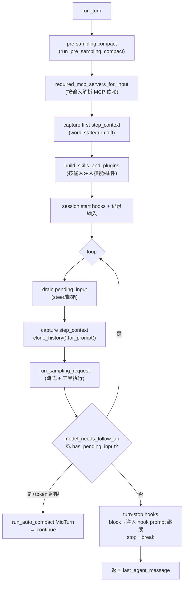
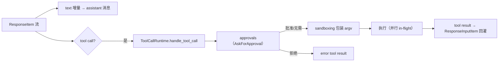

# 3. 运行机制

## 3.1 Turn 循环

`run_turn`（`codex-rs/core/src/session/turn.rs:153`）是单次 turn 的驱动：

要点：

- **多 step 单 turn**：一次用户输入算一个 turn，turn 内多次"采样+工具"循环直到模型不需要 follow-up 且无 pending input（`turn.rs:365-540`）；
- **steer/pending input**：`Session.input_queue` 存运行中消息（`input_queue.rs` 的 `TurnInput::{UserInput, ResponseItem, InterAgentCommunication}`）；turn 开始时与每次采样后都检查 `has_pending_input`（`turn.rs:397-405`、`486-494`）；
- **令牌管理**：采样后检查 `context_window_token_status`，`token_limit_reached` 时 `run_auto_compact(CompactionReason::ContextLimit, MidTurn)` 后继续（`turn.rs:445-475`）；
- **停止 hooks**：`run_turn_stop_hooks` 可 block（注入 continuation 提示继续）、stop（退出）、或走 legacy after-agent hook（`turn.rs:511-550`）；
- **错误路径**：`TurnAborted` 直接返回；非法图片提示移除重试；其他错误发 `ErrorEvent` 后 break 让用户继续对话（`turn.rs:552-585`）。

## 3.2 采样与工具执行

`try_run_sampling_request`（`turn.rs:2179`）：

- 用 `client_session.stream(...)` 发起 Responses API 流（`turn.rs:2227-2240`）；
- 响应 item 流由 `FuturesOrdered<BoxFuture>` 管理 in-flight 工具调用（`turn.rs:2245-2255`），支持并行工具；
- `AssistantMessageStreamParsers` 处理流式文本增量，plan mode 有专用状态机（`turn.rs:1592-1655`）；
- 工具通过 `ToolCallRuntime`（`tools/parallel.rs:41`）执行：路由 →（approval/沙箱）→ 执行 → 结果回写会话。

## 3.3 工具注册表

`ToolRegistry`（`tools/registry.rs:271`）：

- `ToolName` 带命名空间（`mcp__server__tool`、`functions.*` code-mode 命名），`register_trusted`/`register_external` 区分内置与外部工具（外部同名工具默认跳过并记录 collision，`registry.rs:344-372`）；
- `CoreToolRuntime` trait 是工具统一接口；`ToolExposure` 控制工具是否对模型可见；
- 内置工具集（`codex-rs/tools` crate）：`apply_patch`、`shell_command`/`exec_command`、`web_search`（`tool_spec.rs:33`）、MCP 工具、动态工具、image 工具等；speculative/plan（`tools/spec_plan.rs`）做工具建议/计划模式。

## 3.4 权限与审批

`AskForApproval`（`protocol/src/protocol.rs:924`）四级：

- `Never`：不询问，直接失败；
- `UnlessTrusted`：信任的项目不询问；
- `OnRequest`：工具请求时询问；
- `Granular(GranularApprovalConfig)`：按类别（bash/文件编辑/网络…）精细配置。

执行决策在 `exec_policy.rs`：命令先被 `canonicalize_command_for_approval` 归一化，再匹配规则文件（prefix/heuristics），产出 `Forbidden | Prompt | Allow`（`Decision` 枚举定义在 `codex-rs/execpolicy/src/decision.rs:9`，策略映射见 `exec_policy.rs:761-800`）；危险命令启发式列表含 `rm`、`sudo`、`python -c`、shell `-lc` 等（`exec_policy.rs:120-160`）。审批请求可交给 **Guardian**（自动审核器，`guardian/`、`tools/approvals.rs:9-11`）或 MCP elicitation reviewer。

## 3.5 Hook 事件

`codex-rs/hooks/src/events/` 声明 8 类（快照）：

| Hook | 时机 | 可做 |
|---|---|---|
| `SessionStart` | 会话开始/恢复 | 注入上下文/拒绝 |
| `UserPromptSubmit` | 用户输入提交 | 改写/注入 |
| `PreToolUse` | 工具执行前 | block/改写输入 |
| `PostToolUse` | 工具成功后 | 追加上下文/阻断后续 |
| `Stop` | turn 将停止 | block（继续）/stop/子代理 stop |
| `SessionEnd` | 会话结束 | 收尾 |
| `PermissionRequest` | 审批请求 | 决策 `PermissionRequestDecision` |
| `Compact`（Pre/Post） | 压缩前后 | 改写压缩输入/结果 |

运行时在 `core/src/hook_runtime.rs`（PreToolUse 的 block 语义见 `hook_runtime.rs:169-230`；异步 hook 结果经 `async_hook_results` 通道在下一 turn 前 drain）。
