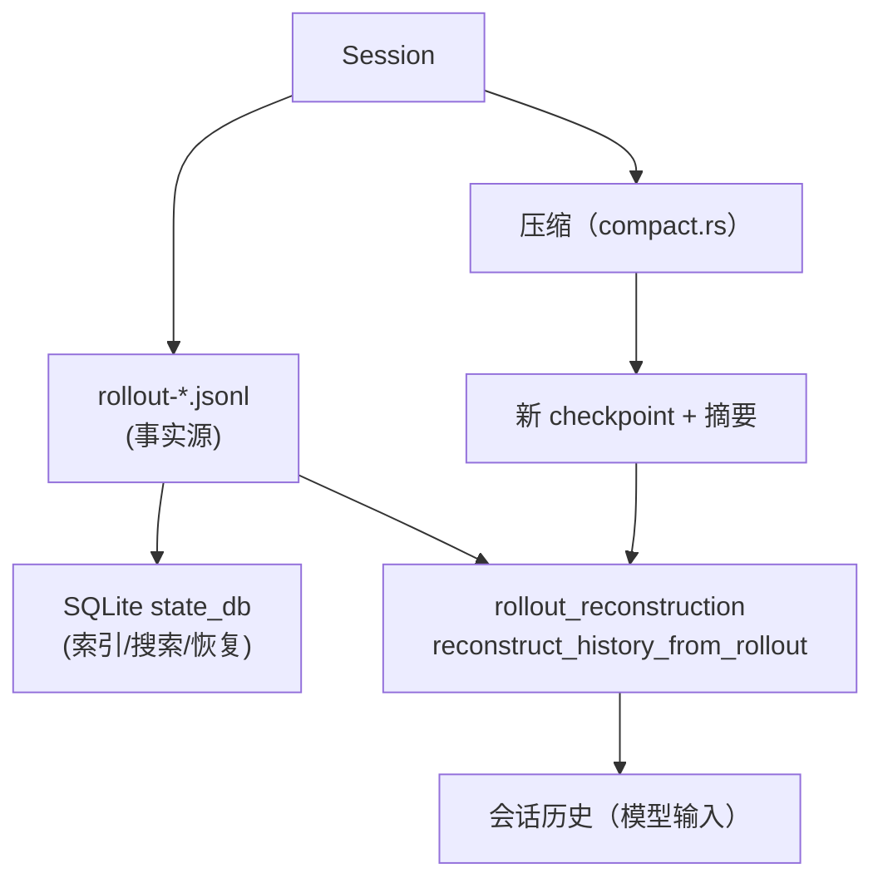

# 4. 会话、持久化与上下文

## 4.1 存储：rollout JSONL + SQLite

Codex 的会话持久化是**双轨**：

- **rollout JSONL**：`~/.codex/sessions/<thread_id>/rollout-*.jsonl`，每行一个 `RolloutItem`（`codex-rs/rollout/src/recorder.rs`），记录 response items、工具调用/结果、事件、审批等全部事实；支持压缩归档（`compression.rs` 的 `spawn_rollout_compression_worker`）、反向扫描（`reverse_jsonl_scanner.rs`）；
- **SQLite state db**：`rollout/src/state_db.rs` 维护线程索引、搜索（`search.rs`）、会话元数据，支持快速列表/恢复；
- thread/revert 会创建新 rollout 文件（`protocol/src/thread_id.rs:22-24`），`rollout_reconstruction.rs`（`core/src/session/rollout_reconstruction.rs:114`）从 rollout 重建历史（含 checkpoint 后的存活尾部）。

## 4.2 会话状态与操作

`Session`（`core/src/session/session.rs:40`）持有：thread_id、active_turn、input_queue、async_hook_results、MCP refresh、guardian review、fork_persistence、services（provider/rollout/events）。

用户可操作（`session/handlers.rs`）：interrupt（60）、clean_background_terminals、inter_agent_communication（82）、run_user_shell_command（104）、exec_approval（174）/patch_approval（205）、request_user_input_response、request_permissions_response、dynamic_tool_response、refresh_mcp_servers、reload_user_config、compact（244）、thread_rollback（251，`thread/revert`）。

## 4.3 上下文工程

- **上下文组装**：每次采样前 `clone_history().for_prompt(input_modalities)`（`turn.rs:355-365`）；`StepContext` 快照同一请求视图（上下文、advertised tools、tool calls）；
- **incremental context**：`record_context_updates_and_set_reference_context_item`（`turn.rs:230`）维护 reference item 做增量注入；
- **技能/插件注入**：`build_skills_and_plugins`（`turn.rs:758`）按输入显式/隐式提及（`collect_tool_mentions_from_messages`、`collect_explicit_plugin_mentions`）注入；
- **AGENTS.md**：`agents_md_manager.rs` 管理项目指令文件；
- **turn diff**：`TurnDiffTracker` 追踪每个环境（cwd）的文件改动，呈现给模型/UI（`turn_diff_tracker.rs`）；
- **记忆**：`memories` crate + `client.rs:717 summarize_memories`（跨会话长期记忆摘要）。

## 4.4 压缩（Compaction）

`core/src/compact.rs` + `compact_token_budget.rs` + `compact_model_fallback.rs` + `compact_remote*.rs`：

- 触发：pre-turn（`run_pre_sampling_compact`，`turn.rs:1012`）、mid-turn 上下文上限（`turn.rs:445`）、用户请求（`CompactionReason::UserRequested`，`compact.rs:162`）、远端压缩（Responses 支持时用 provider 侧压缩）；
- 机制：生成摘要 + 保留最近上下文（`compact_token_budget`），写入新 rollout checkpoint；token 预算支持共享/分窗（`compact_token_budget.rs`）；
- 失败降级：`compact_model_fallback`（默认模型失败换备用模型摘要）。

## 4.5 与 pi/dsh 会话模型对比（快照级）

| 维度 | codex | pi | dsh |
|---|---|---|---|
| 事实源 | rollout JSONL（ResponseItem 序列） | JSONL v3 消息树（id/parentId） | SessionEvent 追加日志（~50 事件） |
| 索引 | SQLite state_db（搜索/恢复） | 无（全量扫描） | 可选 SQLite（openAt: never 默认） |
| fork | thread/revert 新 rollout | 树分支/fork/clone | seed 前缀 fork + parentSession |
| 压缩 | 摘要 checkpoint（含远端压缩） | 摘要 + firstKeptEntryId | compaction 事件 + tool-result pruner |
| 版本 | 无显式格式版本（兼容读取） | v3（自动迁移） | v0（无迁移，拒绝） |
