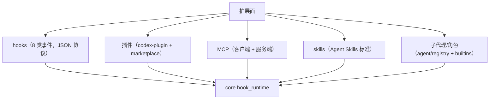

# 5. 扩展系统与运行模式

## 5.1 扩展面总览

Codex 的扩展是**多机制并存**（不是单一插件体系）：

## 5.2 Hooks

- 声明在 `codex-rs/hooks/src/events/`（SessionStart/UserPromptSubmit/PreToolUse/PostToolUse/Stop/SessionEnd/PermissionRequest/Compact），JSON schema 化（`schema.rs`、`write_hooks_schema_fixtures`）；
- 运行时 `core/src/hook_runtime.rs`：同步 hook 立即执行，异步 hook 结果排队（`async_hook_results`）在下一 turn 前 drain（`turn.rs:158`、`430`）；
- hook 可 block 工具/停止 turn/注入上下文（PreToolUse block 见 `hook_runtime.rs:169-230`；Stop block 见 `turn.rs:511-525`）；
- 配置位置：config.toml 的 `[hooks]`；hook 可用 `codex hook` 子命令调试。

## 5.3 插件与 marketplace

`codex-rs/core-plugins`：

- `plugin.rs`（`manifest.rs`、`loader.rs`、`manager.rs`）：插件清单、加载、生命周期；
- `marketplace.rs`（`marketplace_add/remove`、`installed_marketplaces`）：插件市场安装/卸载；
- 插件可贡献：工具（executor hooks）、指令、上下文、App MCP 路由（`app_mcp_routing.rs`）、CLI 命令迁移等；
- CLI：`codex plugin` 子命令（`cli/src/main.rs:156`）；agent plugin manifest（`agent_plugin_manifest.rs`）。

## 5.4 MCP

- **客户端**：`core/src/session/mcp.rs`（server 生命周期、刷新 `mcp_refresh.rs`、prewarm、elicitation 审批桥 `mcp_elicitation_reviewer`）+ `codex-rs/tools/src/mcp_tool.rs`；工具名 `mcp__<server>__<tool>`；输入可声明 MCP 依赖自动加载（`required_mcp_servers_for_input`，`turn.rs:657`）；
- **服务端**：`codex-mcp` crate + `codex mcp-server`（stdio），把 Codex 作为 MCP server 暴露；
- 配置：`codex mcp` 管理外部 server。

## 5.5 Skills

- `codex-rs/skills`（`skill.rs` 等）+ `core/src/mcp_skill_dependencies.rs`（技能 MCP 依赖提示/安装）；
- 技能按输入显式/隐式提及注入（`emit_explicit_skill_invocations`、`build_skills_and_plugins`，`turn.rs:758`）；
- 与 pi 的 skills（Agent Skills 标准、渐进披露）同源思想。

## 5.6 子代理与角色

- `AgentRegistry`（`core/src/agent/registry.rs`）：线程树、spawn 上限（`reserve_spawn_slot`）、昵称、深度限制（`next_thread_spawn_depth`/`exceeds_thread_spawn_depth_limit`）；
- `AgentControl`（`agent/control/`）：spawn（`spawn.rs:217`）、user authorization（`user_authorization.rs:20`）、residency 驱逐（`residency.rs`，v2 子代理驻留管理）；
- 角色：`agent/role.rs` + builtin 模板 `agent/builtins/{awaiter,explorer}.toml`（等待者/探索者角色）；
- 协作模式：`collaboration-mode-templates` crate、`session/multi_agents.rs`（多 agent 会话）。

## 5.7 运行模式

| 模式 | 入口 | 说明 |
|---|---|---|
| TUI | `codex`（默认，`tui/src/lib.rs:929 run_main`） | 交互终端 |
| Exec | `codex exec "task"`（别名 `-e`） | 非交互，`--json` JSONL 事件，`--sandbox`/`--dangerously-bypass-approvals-and-sandbox`（`exec/src/lib.rs:215`） |
| Review | `codex review` | 非交互代码评审 |
| MCP server | `codex mcp-server` | stdio MCP 服务 |
| App server | `codex app-server` / `codex app`（桌面） | 共享本地 daemon + 远程控制（`remote-control`） |
| Agents | `codex agents` | 浏览 app-server 上所有 agent 会话 |
| 云任务 | `codex cloud`（experimental） | Codex Cloud 任务浏览/应用 |
| SDK | `sdk/typescript`、`sdk/python` | 程序化嵌入 |

全部模式复用 `core` 的 `Session`/`run_turn`；exec-server（`codex exec-server`）把沙箱执行拆成独立服务（`cli/src/main.rs:225`）。
