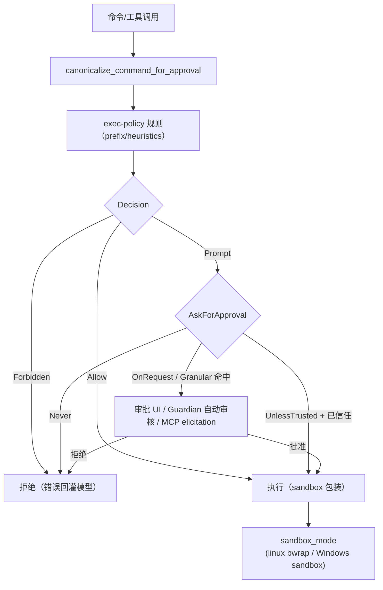

# 7. 安全、权限与测试

## 7.1 权限模型

Codex 是三框架中权限体系最重的：

源码要点：

- `AskForApproval`（`protocol/src/protocol.rs:924`）；`GranularApprovalConfig` 按类别细配（`protocol.rs:950`）；
- exec-policy：规则文件（`execpolicy` crate）+ 危险命令启发式（`exec_policy.rs:120` 起），支持用户/项目规则层（`config_layer_stack`）；
- 审批流：`tools/approvals.rs`（`approval_id`、`approval_reason`、网络审批上下文），`session/handlers.rs:174 exec_approval`/`205 patch_approval`；Guardian 自动审核（`guardian/`），MCP elicitation 桥（`session/mcp.rs`）；
- 信任模型：`trust_level = "trusted" | "untrusted"`（`config/mod.rs:2221-2226`），`AskForApproval::UnlessTrusted` 依赖项目信任状态；旧 `untrusted` 策略已移除（`config/mod.rs:199`）。

## 7.2 沙箱

- `sandboxing` crate 统一策略；`linux-sandbox`（bwrap）、`windows-sandbox-rs`；
- `codex sandbox` 子命令 + `sandbox_setup.rs`；`--sandbox` CLI 参数（`exec/src/lib.rs:273`）；
- exec-server（`codex exec-server`）把执行与沙箱拆成独立服务（`cli/src/main.rs:225`、`exec-server/`），支持远程环境注册。

## 7.3 凭证与供应链

- 凭证：`codex-login`（API key 存 keyring，`keyring-store` crate；ChatGPT 账号 token 存 `~/.codex/auth.json` 类文件）；`logout` 子命令清除；
- 供应链：`MODULE.bazel` + `Cargo.lock` + `pnpm-lock.yaml` 三锁；`deny.toml`（cargo deny）；`SECURITY.md`；发布走 GitHub Releases + 自更新（`update` 子命令）；
- 安装脚本默认从 `releases.openai.com/codex` 下载（README）。

## 7.4 测试体系

`codex-rs` 各 crate 内置 `*_tests.rs`（如 `turn_tests.rs`、`rollout_reconstruction_tests.rs` 2019 行、`spec_plan_tests.rs` 2869 行）；仓库级：

- `bazel test //...`（`BUILD.bazel`/`MODULE.bazel`）；
- Rust：`cargo test`（每 crate）；`justfile` 常见任务；
- 快照/测试夹具：`session/snapshots/`（rollout 重构快照）、`workspace_root_test_launcher`（Windows 测试启动器）；
- 集成：`core/src/session/tests.rs`（11462 行）覆盖 turn/队列/压缩；
- TUI 有独立测试；`codex exec` 的 JSONL 事件处理器有专门测试（`exec/src/event_processor_with_jsonl_output.rs`）。

## 7.5 风险观察

- 单厂商绑定：默认 provider/auth 深度绑定 OpenAI；自定义 provider 存在但非一等公民；
- 权限面复杂度高：`AskForApproval` 四态 + 规则 + 沙箱 + Guardian + MCP 审批桥，配置错误易造成"过松/过紧"两极；
- rollout 无显式格式版本（靠兼容读取），长期升级迁移成本未知（dsh 相反：v0 拒绝旧日志）；
- 插件/marketplace 与 MCP 都是任意代码/服务面，需与权限模型配合使用。
