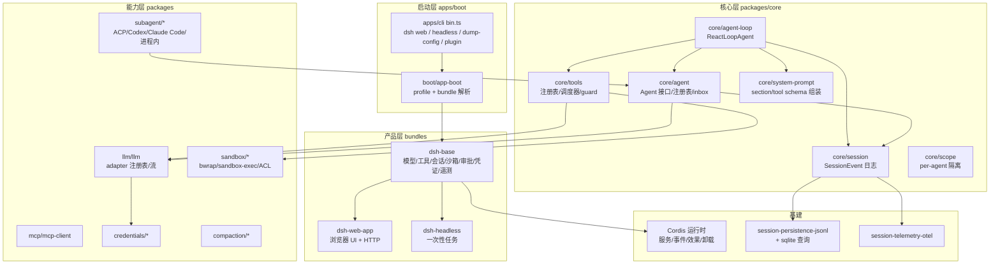

# 2. 架构与依赖

## 2.1 分层：配置树即架构

## 2.2 Profile / Bundle / Patch 三层组装

`packages/boot/app-boot/src/profile.ts` 是组装器（入口分发在 `apps/cli/src/bin.ts:29` 的 mode switch）：

- **Profile**：`$DSH_HOME/profiles/<name>/`，含 `package.json`（`dsh.profile.bundles` 有序 bundle 列表）+ 用户 `cordis.patch.yml`（`PROFILE_PATCH_FILENAME`，`profile.ts:36`）。
- **Bundle**：npm 包，`package.json` 的 `"dsh": { "bundle": { "patch": "./cordis.patch.yml" } }`（`profile.ts:44-57`）。
- **Patch**：对行（row）按 id 整体替换 config 或插入新行；顺序 = bundle 列表 → profile 补丁 → home 补丁 → `--patch` overlay（`profile.ts:8-15` 注释）。
- 内置模板：`PROFILE_TEMPLATES = { web: [dsh-base, dsh-web-app], headless: [dsh-base, dsh-headless] }`（`profile.ts:114`）。
- 模块解析双锚点：先 dsh 安装，再 profile 目录（`profile.ts:18-25`）。

`dsh-base` 的 `cordis.patch.yml` 实际插入的行（快照）包括：llm、session、typert（类型注册表/API gateway）、agent、agent-default-model（默认 `deepseek-official/deepseek-v4-flash`）、jobs、llm-retry、settings、credentials-local、llm-pi-ai（休眠的 pi-ai 多提供商孪生）、session-persistence-jsonl、attachment-local、session-query-sqlite（全文搜索 opt-in）、session-projection、session-telemetry-otel（默认 DISABLED）、subprocess-local、sandbox-local、sandbox-policy（默认 `workspace-write`）、bash-sandbox/pwsh-sandbox、user-approval（默认 `ask`）、permission-presets（三档）、shell-env、tool-bash/tool-pwsh/tool-jobs、fs-observation-policy、tool-fs/tool-fs-search、agent-instructions、skill/skill-filesystem、commands、feedback、goal 等。

## 2.3 关键包与职责

| 包 | 职责 | 关键文件 |
|---|---|---|
| `core/session` | 追加式 `SessionEvent` 日志、会话树/元数据、repair | `src/index.ts`（1157 行）、`src/types.ts` |
| `core/agent` | `Agent` 接口、live 注册表、inbox、事件分发 | `src/index.ts`（706 行）、`src/runtime-types.ts` |
| `core/agent-loop` | `ReactLoopAgent` 驱动、工具调度 | `src/agent.ts`、`src/tool-calls.ts` |
| `core/tools` | 工具 schema/注册/调度/guard/呈现模式 | `src/index.ts`（1946 行）、`src/code-mode.ts` |
| `core/system-prompt` | 提示 section/动态 context/tool schema 组装 | `src/index.ts`（545 行） |
| `core/scope` | per-agent 注册隔离（scoped events/layers） | `src/index.ts`、`src/store.ts` |
| `llm/llm` | `LlmAdapter` 注册表、流、retry、失败归一化 | `src/index.ts`（1026 行）、`src/types.ts` |
| `llm/llm-pi-ai` | pi-ai 多提供商孪生适配（DeepSeek 官方 + 社区 provider） | `src/adapter.ts`、`src/catalog.ts` |
| `boot/app-boot` | profile/bundle/patch 解析 | `src/profile.ts` |
| `sandbox/sandbox*` | 沙箱能力缝（local/policy/windows-acl） | `src/index.ts`、`src/escalation.ts` |
| `credentials/*` | 凭证缝（引用式，`env/file/project-env/user-env`） | `src/index.ts`、`src/types.ts` |
| `subagent/*` | 子代理 provider 注册表 + continuation | `src/index.ts` |
| `mcp/mcp-client` | 内置 MCP 客户端 | `src/` |
| `compaction/*` | 会话压缩（command/基础/工具结果裁剪） | `src/` |
| `goal`/`plan`/`jobs`/`schedule` | 目标驱动、计划、后台任务、定时 | `src/` |
| `client/ui-*` | Web 客户端组件（会话/工具/审批/设置/子代理…） | `packages/client/` |

## 2.4 依赖方向与解耦

- **无反向依赖**：`core/*` 只依赖 Cordis 与彼此；能力（llm、sandbox、subagent、credentials）通过"Service Definition / Provider / Consumer"三角色缝解耦（`docs/architecture.md` capability seams）——例如 `fs` 与 `subprocess` 共享同一执行世界，换 provider 就把 bash/PTY/LSP 一起搬走。
- **循环不 import 具体工具**：`ReactLoopAgent` 只依赖 `ctx.tools` 服务与 `ToolSchema`，工具实现是插件。
- **日志驱动上下文**：`session.deriveMessages()` 是模型历史唯一来源，UI/回放/持久化/telemetry 都从同一事件流派生。
