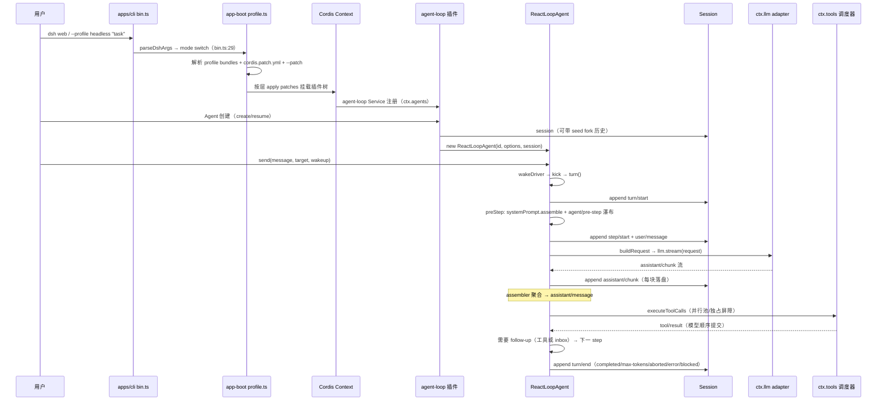
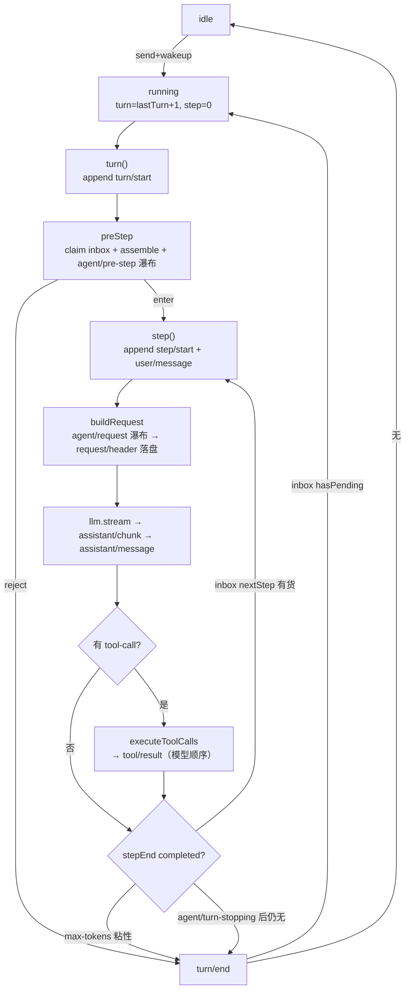
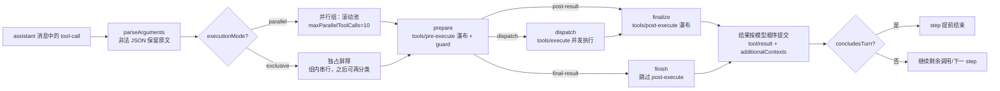

# 3. 运行机制

## 3.1 启动流程

## 3.2 Turn / Step 双层循环

`ReactLoopAgent`（`packages/core/agent-loop/src/agent.ts:64`）的状态机：

要点（源码对应）：

- **turn 边界**：`turn()` 先 `append('turn/start')`（`agent.ts:246` 起），`finally` 一定 `append('turn/end', {reason})`；turn 是"零个或多个 step"，首个 claim 被 reject 或改写为空时仍记录一次"没花 step 的 turn"（`agent.ts:271-290`）。
- **step 边界**：`step()` = 一次模型请求 + 其工具调用；`step/start`、`user/message`、`assistant/chunk*`、`assistant/message`、`tool/call*`、`tool/result*`、`step/end` 全部落盘（`agent.ts:332` 起）。
- **inbox 三通道**：`send(msg, target, wakeup)` 决定目标边界——`next-turn`（新 turn 唯一消息）、`next-step`（当前 step 结束后立刻消费，用于 steer/inject）；`followup`=next-turn+wake，`steer`=next-step+wake，`inject`=next-step 不 wake（`agent.ts:113-132`）。注入的上下文消息在模型请求前才被 claim。
- **停止条件**：`step` 返回 `completed`/`max-tokens`；max-tokens **粘性**（后序正常 step 不降级 turn 结果）；turn 结束前跑 `agent/turn-stopping`（串行，无 next），之后若 inbox 还有货则继续新 step/turn（`agent.ts:302-317`）。
- **错误契约**：`LlmError` 保留结构化 failure，其他异常扁平化为 `{code:'UNKNOWN'}`；abort 记录 `turn/end reason=aborted`（`agent.ts:324-344`）。请求失败走 `agent/request-error` 瀑布决定是否 `retry`（`agent.ts:374-390`）。
- **max-parallel-tool-calls**：全局调度上限，默认 10（`packages/core/agent-loop/src/constants.ts:1`）。

## 3.3 工具执行管道

`executeToolCalls`（`packages/core/agent-loop/src/tool-calls.ts:59`）+ 调度器 `ToolRuntimeScheduler`（`packages/core/tools/src/index.ts:451`）：

要点：

- **prepare**：`tools/pre-execute` 瀑布可改写执行或拒绝；随后 guard（`ToolGuard`，`tools/src/index.ts:704`）做单调拒绝——任何 guard 返回 reason 即拒绝，无 guard 能强放行被拒调用；agent-scoped guard 只作用于该 agent（`tools/src/index.ts:1101-1110`）。
- **并行语义**：并行调用用有界滚动池，`tool/call` 按模型顺序记录；结果与附加上下文**按模型顺序提交**，与完成顺序无关（`tool-calls.ts:87-160`）。
- **abort**：已启动调用先落定并提交结果；未启动调用写合成错误结果 `TOOL_ABORTED_BEFORE_DISPATCH`，保证回放一致（`tool-calls.ts:170-181`）。
- **concludesTurn**：工具结果可声明"本 turn 结束"（如子代理完成/用户确认类工具），提前终止 step（`tools/src/index.ts:565`）。
- **持久化配对**：`tool/result` 通过 `sourceEventSeqs: [callSeq]` 引用 `tool/call`，回放时可还原完整工具卡片（`tool-calls.ts:186-196`）。

## 3.4 事件域

事件分三个域（`docs/architecture.md`）：

| 域 | 例子 | 是否持久化 |
|---|---|---|
| **Session 事件** | `turn/*`、`step/*`、`user/message`、`assistant/*`、`tool/*`、`approval/*`、`compaction/*`、`goal/change`、`subagent/descriptor`、`team/*` | 是（追加日志，~50 种，`packages/core/session/src/known-event-types.ts:19`） |
| **Agent 事件** | `agent/status`、`agent/pre-step`、`agent/request`、`agent/request-error`、`agent/turn-stopping`、`agent/inbox/*` | 否（live 分发） |
| **能力事件** | `fs/*`、`tools/pre-execute`、`tools/execute`、`tools/post-execute`、`telemetry/*` | 否（缝的钩子） |

瀑布（waterfall）与串行（serial）是两种监听语义：瀑布监听者必须调用 `next()` 委托，返回值权威（如 `agent/pre-step` 决定模型看到什么）；串行监听者按序执行但无委托（如 `agent/turn-stopping`）。
