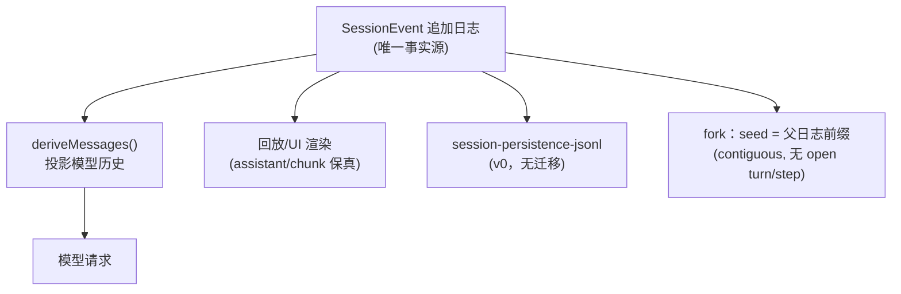

# 4. 会话、上下文与压缩

## 4.1 会话日志：唯一事实源

`core/session` 把会话建模为**追加式 `SessionEvent` 日志**（`packages/core/session/src/index.ts`），不是消息数组：

- 每个事件有 `seq`、`type`、`data`；消息类事件（user/assistant/tool result）只是其中几种（`packages/core/session/src/types.ts`）。
- 格式版本 `SESSION_FORMAT_VERSION = 0`（`types.ts:56`）：harness 未发布，版本 0，**不承诺兼容、不提供迁移**；load 时版本不符直接拒绝。
- 事件词表 ~50 种（`packages/core/session/src/known-event-types.ts:19`，脚本生成，含 `ignorable` 标记机制：新版本新增事件若带 `ignorable`，旧版本可安全跳过，否则拒绝）。
- **模型上下文由日志派生**：`deriveMessages()` 投影出模型可见历史；"模型可见即已落盘"是运行时不变式（`docs/architecture.md`，`runtime-context.ts` 在循环内断言）。UI、回放、telemetry、持久化全部消费同一事件流。

## 4.2 会话头与 fork 血缘

`SessionHeader`（`types.ts:63-106`）：`version`、`id`、`createdAt`、`cwd`、`parentSession`、`seedLength`（继承边界）、`origin: 'subagent'`、`delegationDepth`（递归预算，持久化保证 resume 后不重置）、`agentPreset`（决定工具与提示的组合，持久化避免 resume 后模型无法复现历史动作）。

Fork 通过 `CreateAgentOptions.seed`（`packages/core/agent/src/index.ts:70-84`）：父日志的"完整已结束 turn 前缀"作为 seed 传入，session 持久化边界在发布前校验（contiguous、lossless-JSON、无 open turn/step、无 dangling tool call）。

## 4.3 会话操作

- `ctx.sessions.fork(source, boundary?, childSessionId?)`：fork 活会话（`docs/architecture.md`）；
- resume：`ResumeAgentOptions` 从持久化日志重建（`packages/core/agent/src/index.ts`）；
- `session/end-seed`、`session/title` 等事件标记边界与标题；
- `session-query-sqlite`：可选全文搜索（`openAt: never` 默认，搜索调用显式报 `SESSION_QUERY_SEARCH_DISABLED`，`packages/bundle/base/cordis.patch.yml`）；
- attachment：图片等大字节存日志外，消息里是内容寻址引用（`attachment-local`，`cordis.patch.yml` 注释）。

## 4.4 上下文工程

`core/system-prompt`（`packages/core/system-prompt/src/index.ts`）：

- **PromptSection**：命名、有序（`order`）、静态文本或 provider 函数；`complete: true` 可整体替换系统提示（`index.ts:53-75`）。惯例：`-100` harness 身份、`0` persona、工具指导 100-199。
- **PromptContext**：动态上下文（如时间、文件引用、指令文件），作为 durable user-role 快照注入（`index.ts:78-92`）。
- **PromptAssembly**：sections + contexts + tools + variables；`renderPrompt` 做 `{{variable}}` 插值。
- **`system-prompt/assemble` 瀑布**：每个 turn 组装时跑，可改写 assembly；作用域过滤（agent-scoped 监听只影响该 agent 的组装，`index.ts:26-36`）。
- 每 step 组装一次（`agent.ts` preStep → `loopCtx.systemPrompt.assemble`），工具 schema 由 `ctx.tools` 提供并进入组装（`agent.ts:332-360`）。

## 4.5 压缩（compaction）

`packages/compaction/` 三个包：

- `compaction/compaction`：核心逻辑（切点、摘要）；
- `compaction/command-compact`：手动 `/compact` 命令；
- `compaction/compaction-basic`：基础实现（会话摘要）；
- `compaction/compaction-tool-result-pruner`：**工具结果裁剪**（保留大工具输出的引用/摘要而非全文）。

会话事件词表包含 `compaction/start`、`compaction/summary`、`compaction/prune`、`compaction/end`（`known-event-types.ts`）——压缩本身也是可回放/可审计的日志事实；`session/end-seed` 与 fork 协同。

## 4.6 长期记忆/上下文注入

- `agent.inject()`：向下一 admitted 请求注入上下文（`docs/architecture.md` 扩展点表）；
- `packages/context/`：agent-instructions（项目指令，maxBytes 65536）、file-reference、session-reference、time-context、tmux-context 等插件化上下文源；
- `session-title`：LLM 生成标题（`session/title-llm-request` 事件），可回退规则式标题。
