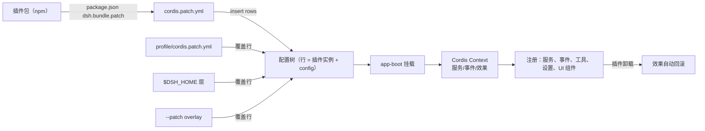

# 5. 扩展系统与运行模式

## 5.1 扩展模型：Cordis 插件 + 配置树

dsh 的"扩展"不是事后 API，而是**构建方式本身**：

注册面（源码）：

| 能力 | 机制 |
|---|---|
| 模型提供商 | `ctx.llm.registerAdapter(providers, adapter)`（`packages/llm/llm/src/index.ts:365`） |
| 工具 | 注册到 `ctx.tools`（ToolDefinition，schema 由 JSON Schema/TS/Python 生成，`packages/core/tools/src/`）；模型可见性经 `agent-tool-presentation` |
| 系统提示 | `ctx.systemPrompt.section/context`（有序） |
| 会话状态 | 扩展 `SessionEventMap` 新增事件类型 + 从日志渲染（`docs/architecture.md`） |
| 人类命令 | `ctx.commands`（不经模型 turn 直接分发，如 `command-feedback`） |
| 后台任务 | `ctx.jobs`（`job_*` 工具收集/停止） |
| shell/终端 | `ctx.shell` / `ctx.terminals` backend |
| fs/策略 | `ctx.fs` provider 或 `fs/*` 事件 |
| 沙箱 | `ctx.sandbox` backend |
| 子代理 | `ctx.subagents` provider |
| 目标 | `ctx.goals`（同会话目标管理） |
| UI | `ConversationNodeDefinition` + keyed renderer（Web Client Chat 节点） |
| 设置页 | settings card（`client/ui-settings-*`） |

## 5.2 作用域：per-agent 隔离

`core/scope`（`packages/core/scope/src/index.ts`）：

- 每个 `Agent` 有 `agent.ctx`（`packages/core/agent/src/runtime-types.ts` 的 `ctx: Context`）；在 `agent.ctx` 上注册的监听/工具只对该 agent 生效，agent dispose 时回滚；
- `assembleContextFor` / `scopeTarget` 让事件分发按作用域过滤（如 `system-prompt/assemble` scoped 分发）；
- 工具/上下文注册支持"isolate realm"：per-session 能力集组合（agent preset）。

## 5.3 事件扩展点（Agent 域）

`ReactLoopAgent` 分发的事件（live，不持久化）：

- `agent/status`（idle/running，每次 phase 切换）；
- `agent/inbox/inserted|discarded|claimed`（inbox 变更）；
- `agent/pre-step`（瀑布，决定 reject/enter 与消息改写）；
- `agent/request`（瀑布，决定下一次请求的 provider/model/参数）；
- `agent/request-error`（瀑布，决定是否 retry 模型请求）；
- `agent/turn-stopping`（串行，可阻止 turn 结束）；
- `agent/error`（结构化错误上报）。

典型用法：权限策略监听 `tools/pre-execute` 或注册 guard；上下文注入用 `agent/pre-step` 或 `agent.inject()`；RAG/记忆用 `system-prompt/assemble` 或动态 PromptContext；自定义压缩监听 `compaction/*` 或替换 compaction 插件。

## 5.4 运行模式

`apps/cli/src/bin.ts` 的入口分发（`bin.ts:29` 起）：

| 模式 | 命令 | 说明 |
|---|---|---|
| Web | `dsh web` | `--profile web`：HTTP 服务 + 浏览器 UI（默认 `http://127.0.0.1:3080`），`--no-open` 不开浏览器 |
| Headless | `dsh --profile headless "task"` | 无服务器一次性任务：`headless-runner` 直接驱动 Agent 并打印 durable result（`packages/bundle/headless/cordis.patch.yml`） |
| dump-config | `dsh --dump-config` | 打印最终配置树（每行可被 patch 覆盖） |
| plugin | `dsh plugin` | 插件管理子命令（`apps/cli/src/plugin.ts`） |
| ACP | `packages/acp` | Agent Client Protocol 适配（外部宿主嵌入） |

所有模式共享同一 `app-boot` + base bundle 核心，差异只在 bundle 层（web-app 加 HTTP/UI，headless 加一次性 runner）——"模式只是配置"。

## 5.5 子代理（原生能力）

`packages/subagent/subagent/src/index.ts`：

- `ctx.subagents` 是**多 provider 注册表**（与 LLM adapter 类似，不限定单实现）：`subagent-in-process-driver`、`subagent-spawn-in-process`、`subagent-fork-in-process`、`subagent-acp`、`subagent-claude-code`、`subagent-codex`、`subagent-dsh-sdk`；
- 两种生命周期：一次性 run（`start`）与 **continuable child**（`startContinuable`，独立 AgentHandle，所有 turn 经子 agent 自己的 inbox 排序）；
- 递归预算：`delegationDepth` 持久化在 SessionHeader，`assertSubagentMaxDepth` 在创建时校验；
- 实验性 Agent Teams：`packages/experimental/agent-team`（durable roster + task board + mailbox，叠加在 continuable subagents 上）。
