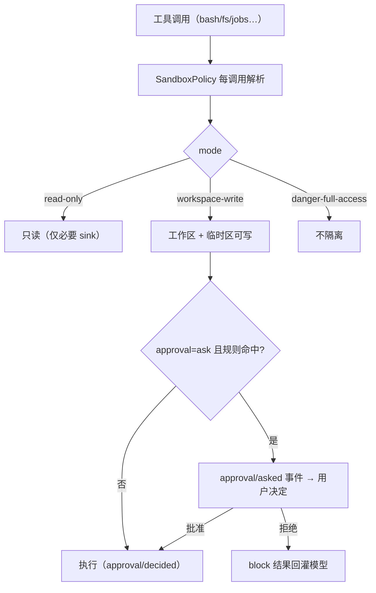

# 7. 安全、权限与测试

## 7.1 权限模型

默认配置（`packages/bundle/base/cordis.patch.yml`）：

- `sandbox-policy`: mode = `workspace-write`（`DSH_PERMISSION_MODE` 可覆盖）；
- `user-approval`: policy = `ask`（`danger-full-access` 时 `never`）；
- `permission-presets` 三档：`read-only`（sandbox=read-only, approval=ask）、`workspace-write`（sandbox=workspace-write, approval=ask）、`danger-full-access`（sandbox=danger-full-access, approval=never）。

源码：

- `SandboxMode`（`packages/sandbox/sandbox/src/index.ts:29`）：`read-only | workspace-write | danger-full-access`；
- `SandboxProvider.confine` 返回 enforcing argv；后端 `sandbox-local`（Linux bubblewrap / macOS sandbox-exec / Windows ACL，`packages/sandbox/sandbox-windows-acl`），e2b 远程沙箱（`packages/e2b/`）；
- **升级审批**：`escalation.ts`（`approveEscalation`/`EscalationApprover`）允许"当前策略下扩大权限重试"走审批流；
- 会话事件 `approval/asked`、`approval/decided`、`approval/policy`、`permission/preset`、`sandbox/mode` 全部持久化（`known-event-types.ts`）——审批历史可回放审计；
- **Code Mode**：`DSH_TOOLS_MODE`（native/code/both）把工具呈现切成 JS 沙箱模式（`packages/code-runtime/`、`core/tools/src/code-mode.ts`）。

## 7.2 凭证与供应链

- 凭证：`$DSH_HOME/.credentials.yaml` 管理文档 + env/project-env/user-env 引用层；模型适配器每请求解析（见 06）；
- 供应链：pnpm lock + `verify-*` 脚本群（`verify-dsh-package-licenses`、`verify-package-invariants`、`verify-config-source-ownership` 等，`package.json` scripts）；`lefthook.yml` pre-commit；
- 遥测默认关闭：`DSH_TELEMETRY_MODE` 显式 opt-in（FULL/FEEDBACK_ONLY），导出含匿名 user id（`cordis.patch.yml` 注释），`THIRD_PARTY_NOTICES.md` 披露三方许可。

## 7.3 测试体系

| 层 | 配置/位置 | 覆盖 |
|---|---|---|
| 单元/集成 | `vitest.config.ts`（`npm test`） | core/session/tools/llm 各包 |
| e2e | `vitest.e2e.config.ts` | 真实模型/集成路径 |
| 快照 | `vitest.snapshot.config.ts`（record/refresh 模式） | 持久化格式与渲染快照，`packages/session/…/snapshots` |
| Web | `vitest.web*.config.ts`（built/perf/stress） | 浏览器 UI 快照、性能、压力 |
| GUI | `packages/client packages/host` | 客户端/宿主 |
| 门禁 | `scripts/run-gates.ts`（`check:ci` 系列，windows/node-compat/consumers） | 发布前全量门禁 |
| fixtures | `migrate-packed-session-fixtures` 脚本 | 打包会话 fixture 迁移验证 |

特点：**日志事件是测试契约**——持久化快照测试直接比对 SessionEvent 序列；`agent-loop` 有 invariant 模块（`invariant.ts`，如"模型可见即已落盘"）把架构不变量变成运行时断言。

## 7.4 风险观察

- developer preview：`SESSION_FORMAT_VERSION = 0` 无迁移，升级可能直接拒绝旧日志；
- 默认 `ask` + `workspace-write` 仍允许模型在 cwd 内写文件，且 `!` 类命令/工具误用面取决于插件组合；
- 插件=任意代码（配置树可加载任何 bundle），供应链验证（许可/清单）已做但运行时隔离依赖 sandbox；
- 事件词表生成与验证（`gen-persistence-catalog`/`verify-persistence-catalog`）强约束扩展新事件必须走生成管线。
