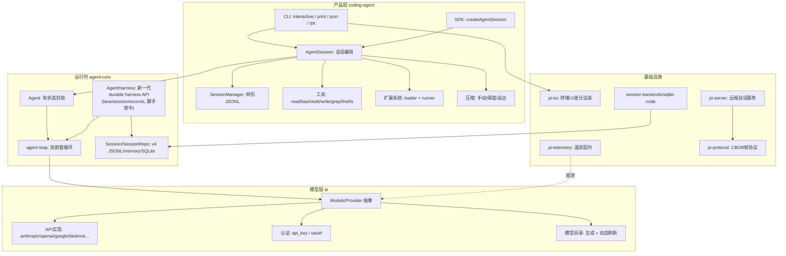

# 1. 核心功能与设计哲学

## 1.1 项目是什么

PI（Pi Agent Harness）是一个开源的终端编码 Agent 框架（MIT 协议），由 Earendil Inc.（作者 Mario Zechner，即 libGDX 作者 badlogic）维护，官方站点 [pi.dev](https://pi.dev)。它是一个 monorepo，当前快照版本 0.84.2。

与 Claude Code、OpenCode 等"开箱即用"的编码工具不同，PI 的定位是 **harness（框架）**：核心尽量小，所有能力都可通过 TypeScript 扩展、skills、prompt templates、themes 组装，并可打包成 pi package 分发。官方口号是 *"primitives, not features"* 与 *"There are many agent harnesses, but this one is yours"*。

## 1.2 设计哲学

### 四工具核心

PI 的默认工具面只有 4 个：

| 工具 | 作用 |
|---|---|
| `read` | 读取工作目录内的文件 |
| `write` | 创建/覆盖文件 |
| `edit` | 定向修改文件（非整体重写） |
| `bash` | 执行 shell 命令 |

当前版本还内置了可选的只读工具 `grep`/`find`/`ls`（`createAllToolDefinitions` 提供，默认激活仍是前 4 个）。这个设计来自对前沿模型行为的观察：模型本身已经理解编码任务，不需要大量脚手架；**短系统提示词 + 少量工具即可产生能用的编码行为**，多余的提示与工具反而污染上下文。

### 刻意省略（不是缺陷）

| 特性 | PI 的立场 | 扩展路径 |
|---|---|---|
| MCP | 不内置，CLI 工具靠 README 或技能 | 用扩展实现 MCP 集成 |
| 子代理 | 不内置 | 扩展或第三方 pi package |
| 权限弹窗 | 不内置，推荐容器隔离 | 扩展实现自定义审批流 |
| plan mode | 不内置 | 文件化计划或自定义扩展 |
| to-do 跟踪 | 不内置 | TODO.md 或扩展 |
| 后台 bash | 不内置，推荐 tmux | — |

### 安全模型

PI **没有逐工具权限系统**，默认以启动用户的权限运行（README "Permissions & Containerization" 原文）。但并非零防护：

- **项目信任门禁**：项目含 `.pi/settings.json`、`.pi/extensions`、`.pi/skills`、`.pi/prompts`、`.pi/themes`、`SYSTEM.md`、`APPEND_SYSTEM.md` 等资源时，启动会弹出 "Trust project folder?" 选择（信任 / 信任父目录 / 仅本次 / 不信任），信任后才加载这些资源、安装项目包并执行项目扩展（`packages/coding-agent/src/core/trust-manager.ts:30`、`project-trust.ts:46`；详见 [07-security-eval.md](./07-security-eval.md)）。
- **bash 输出卫生**：输出剥离 ANSI、清洗二进制垃圾、超限截断并落盘完整日志（`packages/coding-agent/src/core/bash-executor.ts:19`）。
- **沙箱是扩展路径**：官方文档建议容器化（Gondolin 扩展 / Docker / OpenShell），另有 `examples/extensions/sandbox` 演示用 `@anthropic-ai/sandbox-runtime` 在 OS 层（macOS sandbox-exec / Linux bubblewrap）限制 bash 的文件与网络访问。
- **供应链硬化**：直接外部依赖精确锁版本、`package-lock.json` 为事实基准、发布时生成 `npm-shrinkwrap.json`、CI 定期跑 `npm audit`（详见 [07-security-eval.md](./07-security-eval.md)）。

### 两套会话体系

仓库内实际存在**两代会话实现**，文档分别覆盖：

| 体系 | 位置 | 格式 | 状态 |
|---|---|---|---|
| 产品层 `SessionManager` | `packages/coding-agent/src/core/session-manager.ts` | JSONL v3（`CURRENT_SESSION_VERSION = 3`，`session-manager.ts:30`） | CLI/UI 实际使用，支持分支/fork/压缩/迁移 |
| 新一代 durable harness `Session`/`SessionRepo` | `packages/agent/src/harness/session/` | JSONL v4 / memory / SQLite，另存 records 操作日志 | 面向崩溃恢复与多后端一致性；`AgentHarness` 主体方法当前抛 `HarnessNotImplemented` |

详见 [04-session.md](./04-session.md) 与 [03-runtime.md](./03-runtime.md) 的"durable harness"小节。

## 1.3 核心功能清单（按包）

## 1.4 关键设计决策

1. **统一消息/事件模型**：`pi-ai` 定义 `Message`（user/assistant/toolResult）与 `AssistantMessageEventStream`（`start`/`text_delta`/`toolcall_delta`/`done`/`error`），上层所有包共用同一套类型（`packages/ai/src/types.ts`、`packages/ai/src/utils/event-stream.ts`）。
2. **Provider 抽象**：`Provider` 接口（id/auth/models/stream/refresh，`packages/ai/src/models.ts:97`）与 `Models` 集合（`models.ts:156`）分离，可静态目录 + 动态刷新 + 扩展覆盖。
3. **双层 Agent 循环**：低层无状态循环（`runAgentLoop`/`runLoop`，`packages/agent/src/agent-loop.ts:95`/`155`，纯函数、可测试）负责"LLM↔工具"往返；高层有状态 `Agent`（`packages/agent/src/agent.ts:173`）负责 transcript、steer/followUp 队列、取消与事件订阅。
4. **树形 JSONL 会话**：追加式存储 + `id/parentId` 树结构，支持原地分支、fork、clone，压缩通过 `compaction` 条目保留"摘要 + `firstKeptEntryId` 起点"（`packages/coding-agent/src/core/session-manager.ts:72`、`461`）。
5. **压缩是核心能力**：手动/阈值/溢出三种触发（`packages/coding-agent/src/core/agent-session.ts:1864`/`2050`），可被扩展完全接管；自动重试针对瞬时错误（`agent-session.ts:2773` 的 `isRetryableAssistantError`）。
6. **扩展两阶段**：Loader 只负责发现与注册（`packages/coding-agent/src/core/extensions/loader.ts:587`），Runner 绑定运行时 API（`extensions/runner.ts:268`），避免加载期副作用，支持 34 种语义事件（`extensions/types.ts`）。
7. **durable harness 演进方向**：新一代 `AgentHarness` 把会话升级为"entries + records 操作日志"的耐用模型（`packages/agent/src/harness/agent-harness.ts`、`harness/reducer.ts`），支持 lane、挂起/恢复、崩溃检测与多后端（JSONL/memory/SQLite）一致性，本快照仍是脚手架。

## 1.5 与同类工具对比（公开资料）

| 维度 | PI | Claude Code | OpenCode |
|---|---|---|---|
| 核心工具 | 4（可加只读工具） | 40+ | 6（含 browser/search） |
| 系统提示词 | ~1000 token | ~55k token | ~15k token |
| 可扩展性 | TypeScript 扩展 + packages | Hooks + MCP | 插件 |
| MCP | 扩展实现 | 原生 | 原生 |
| 子代理 | 扩展实现 | 原生 | 原生 |
| 提供商 | 15+（自带 key） | 仅 Anthropic | 75+ |
| 后端 | 无（零 SaaS） | Anthropic 云 | 可选 |
| 许可证 | MIT | 专有 | MIT |

对比结论：PI 用"最小核心 + 扩展"换取上下文可控与可塑性，代价是开箱能力少，需要用户或社区按需组装。
