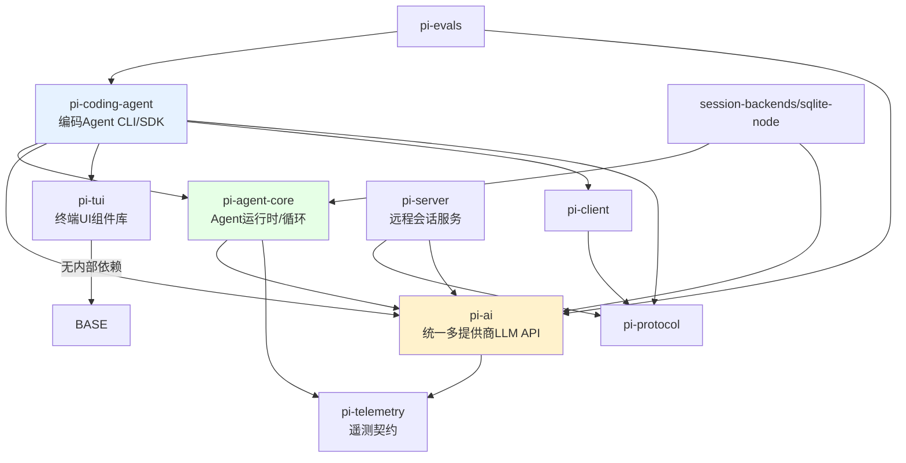

# 2. 架构与依赖

## 2.1 三层分层

PI 是严格的单向分层架构：上层只依赖下层，下层不反向依赖上层。

```mermaid
graph TD
    subgraph L3["产品层 pi-coding-agent"]
        A[AgentSession 会话编排]
        B[SessionManager JSONL]
        C[工具集]
        D[扩展系统]
        E[压缩/重试]
    end

    subgraph L2["运行时 pi-agent-core"]
        F[Agent 有状态封装]
        G[agent-loop 无状态循环]
        H[AgentHarness durable harness<br/>(lane/records, 脚手架)]
    end

    subgraph L1["模型层 pi-ai"]
        I[Models / Provider]
        J[认证 api_key/oauth]
        K[模型目录]
    end

    A --> F
    B -.状态存储.-> A
    F --> G
    G --> I
    H --> I
```

## 2.2 包依赖图



说明：

- `pi-ai` 只依赖 `pi-telemetry`（`typebox` 等基础库除外），是全仓库最可复用的部分；
- `pi-agent-core` 依赖 `pi-ai`/`pi-telemetry`，但它**不**依赖任何具体 provider 实现——`streamFn` 由宿主注入（coding-agent 注入 `modelRuntime.streamSimple`），保证核心循环可独立测试（faux provider + harness）；
- `pi-coding-agent` 是唯一把所有东西组装起来的胶水层：它依赖 agent/ai/tui/client/protocol，并反向向 agent 注入默认流函数（`setDefaultStreamFn(streamSimple)`）；
- `pi-protocol` 是叶子依赖（仅 typebox），`pi-client`/`pi-server` 建立在它之上，用于实验性的远程会话；
- `pi-evals` 基于 vitest 复用 coding-agent 做端到端评估；
- 所有包统一版本号（lockstep versioning），发布时一起升版。

## 2.3 关键类与职责

### pi-ai

| 类型 | 位置 | 职责 |
|---|---|---|
| `Message` / `AssistantMessage` / `ToolResultMessage` | `packages/ai/src/types.ts` | 统一消息模型（含 thinking 内容块、usage、cost） |
| `AssistantMessageEventStream` | `packages/ai/src/utils/event-stream.ts` | 流式事件协议：`start`/`text_delta`/`toolcall_delta`/`done`/`error` |
| `Provider` | `packages/ai/src/models.ts` | 单一 provider 运行时单元：auth + 模型列表 + stream 实现 |
| `Models` / `MutableModels` | 同上 | provider 集合：认证解析、可用性过滤、刷新、成本计算 |
| `createProvider` | 同上 | 从"定义"构建 provider（静态/动态模型、单/多 API 分发） |
| `AuthContext` / `CredentialStore` | `packages/ai/src/auth/*` | 认证解析、凭证持久化、OAuth 刷新 |
| `lazyStream` / `*.lazy.ts` | `packages/ai/src/api/lazy.ts` | 按需加载 provider SDK，降低启动开销 |

### pi-agent-core

| 类型 | 位置 | 职责 |
|---|---|---|
| `Agent` | `packages/agent/src/agent.ts` | 有状态封装：transcript、工具表、steer/followUp 队列、abort、事件订阅 |
| `agentLoop` / `runAgentLoop` | `packages/agent/src/agent-loop.ts` | 无状态循环：LLM↔工具往返、队列注入、事件发射 |
| `AgentTool` / `AgentToolResult` | `packages/agent/src/types.ts` | 工具定义与结果契约（含 `addedToolNames`、`terminate` 提示） |
| `AgentEvent` | 同上 | 生命周期事件（agent/turn/message/tool 四级） |
| `AgentHarness` / `AgentLane` | `packages/agent/src/harness/agent-harness.ts` | 新一代 durable harness API：lane 上执行 run/compaction/navigation/resume/abort/steer/followUp/nextRun，hooks/events 注册；本快照主体方法抛 `HarnessNotImplemented`（脚手架） |
| `Session` / `SessionState` | `packages/agent/src/harness/session/session.ts`、`state.ts` | durable 会话：entries + records 双写、lane 指针、facts（name/label）、stats、单写者 seq 协议 |
| `SessionRepo` + 后端 | `packages/agent/src/harness/session/jsonl/`（v4）、`memory.ts`、`packages/session-backends/sqlite-node/` | 可插拔存储；JSONL v4 兼容 v3 目录布局，SQLite 含 writer leases、branch cache、search 索引；全部过 conformance 测试 |
| `reducer.ts` | `packages/agent/src/harness/reducer.ts` | lane 操作状态机：step（assistant/compaction/branch_summary）、tool batch、deferred、崩溃恢复切片，含 `RecordLogCorruption` 检测 |
| `search/` | `packages/agent/src/search/scanning.ts` | 会话全文扫描搜索（`SessionSearch` 接口，异步迭代命中） |

### pi-coding-agent

| 类型 | 位置 | 职责 |
|---|---|---|
| `AgentSession` | `packages/coding-agent/src/core/agent-session.ts` | 产品层核心编排：事件订阅、持久化、压缩、重试、模型切换、bash |
| `SessionManager` | `packages/coding-agent/src/core/session-manager.ts` | 树形 JSONL 存储：append、branch、fork、上下文重建 |
| `ModelRuntime` | `packages/coding-agent/src/core/model-runtime.ts` | pi-ai `Models` 的产品化封装：模型发现、可用性、认证、流式调用 |
| `ResourceLoader` | `packages/coding-agent/src/core/resource-loader.ts` | 加载 settings/AGENTS.md/扩展/技能/模板/主题 |
| `ExtensionRunner` / Loader | `packages/coding-agent/src/core/extensions/*` | 扩展加载与运行时绑定 |
| `SettingsManager` | `packages/coding-agent/src/core/settings-manager.ts` | 全局 + 项目设置、键位、默认模型/工具 |
| 工具工厂 | `packages/coding-agent/src/core/tools/*` | read/bash/edit/write/grep/find/ls 的实现 |
| `InteractiveMode` | `packages/coding-agent/src/modes/interactive/` | TUI 交互层（interactive-mode.ts 6708 行） |
| `runRpcMode` | `packages/coding-agent/src/modes/rpc/rpc-mode.ts` | stdin/stdout JSONL RPC |
| `createCodingAgentHarness` | `packages/coding-agent/src/server/create-harness.ts` | 把 coding-agent 工具（read/bash/edit/write + prompt snippets）接入 agent-core `AgentHarness` 的适配层 |

## 2.4 关键依赖方向与解耦手段

1. **agent-core 不绑定 provider**：`StreamFn` 类型 + `setDefaultStreamFn()`（`packages/agent/src/stream-fn.ts`），coding-agent 在 SDK 入口注入 `modelRuntime.streamSimple`。
2. **coding-agent 不绑定终端**：`AgentSession` 与 UI 解耦，interactive/RPC/print/json 模式共用同一会话对象，只是各自实现 I/O。
3. **会话存储可插拔（新体系）**：harness 层定义 `SessionRepo` 契约（`packages/agent/src/harness/session/types.ts`），JSONL v4、memory、SQLite 后端都实现同一契约，由 `createSessionBackendConformance`（`packages/agent/src/harness/session/testing/conformance.ts`）做一致性测试。
4. **扩展不绑定内部实现**：扩展只接触 `ExtensionAPI` 与事件，runner 负责把真实实现注入（两阶段设计见 [05-extensibility.md](./05-extensibility.md)）。
5. **评估走真实产品栈**：`pi-evals` 的 harness 直接适配 coding-agent `AgentSession`（`packages/evals/src/pi-harness.ts`），并非基于 agent-core 的 `AgentHarness` 脚手架；详见 [08-eval-testing.md](./08-eval-testing.md)。
