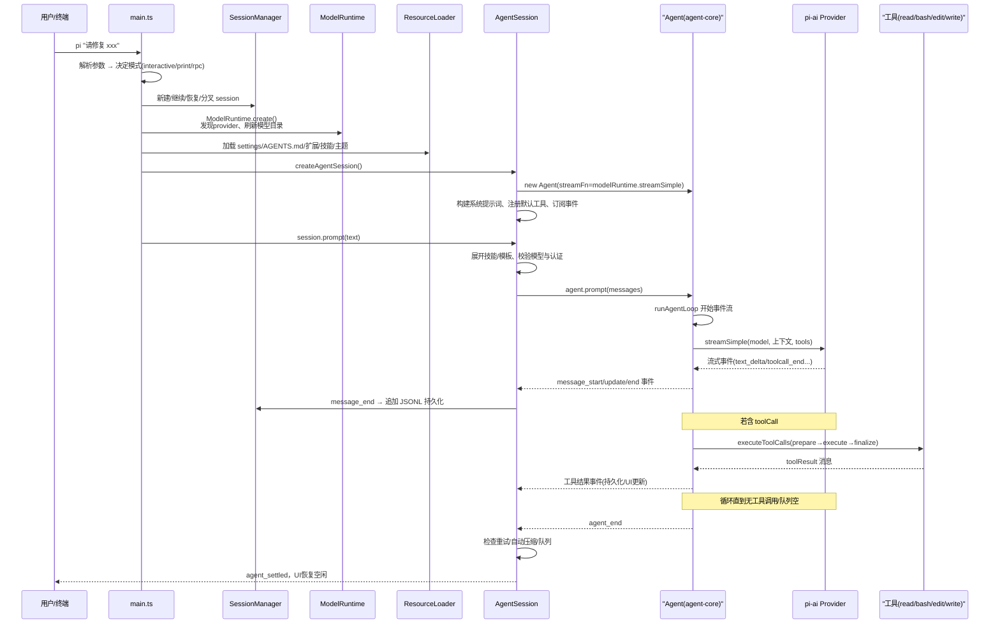
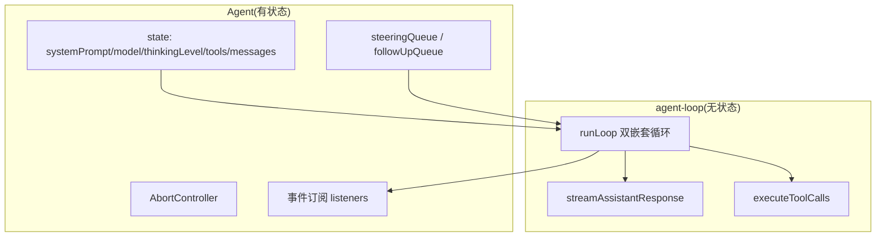
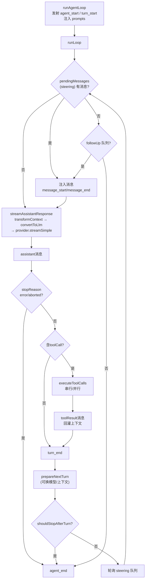
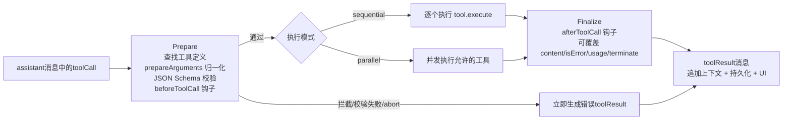
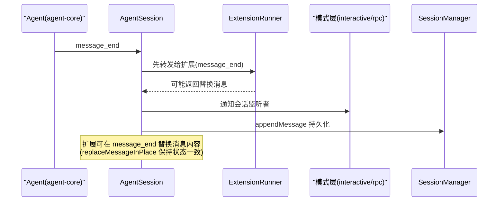
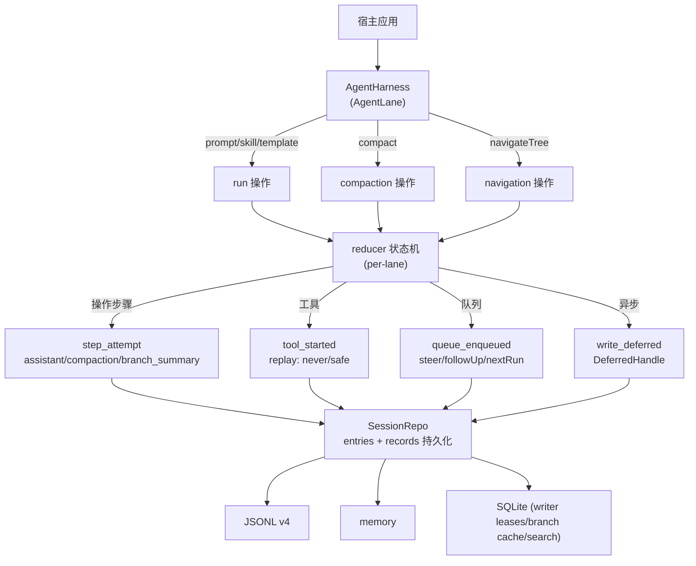

# 3. 运行机制

## 3.1 启动流程

启动要点：

- 会话对象（`AgentSession`）在 CLI 解析阶段之后创建，由 `createAgentSessionServices` 组装 `ModelRuntime`/`SettingsManager`/`ResourceLoader`/`SessionManager`；
- 模型选择优先级：CLI 参数（`--model`/`--provider`）> 会话中恢复的模型 > 设置默认 > 第一个可用模型；thinking level 会按模型能力 clamp；
- 已有会话恢复时，`SessionManager.buildSessionContext()` 从叶子回溯重建消息、模型、thinking 状态；
- 系统提示词由 `buildSystemPrompt` 动态组装（工具列表 + 技能 + 项目上下文文件 + 自定义 prompt）。

## 3.2 Agent 双层循环

### 分层设计

低层循环是纯函数式：输入 `AgentContext + AgentLoopConfig`，通过 `emit` 回调输出 `AgentEvent`，不持有可变状态。高层 `Agent` 持有 transcript 和队列，负责把事件应用到状态并转发给订阅者。

### runLoop 结构

要点：

- **内循环**：一次 LLM 调用 + 该轮全部工具执行为一个"turn"；只要还有 toolCall 或 steering 消息就继续；
- **外循环**：内循环结束后检查 follow-up 队列，有则注入继续，否则 `agent_end`；
- **steering**：用户运行中输入的消息，在当前回合工具执行完后、下一次 LLM 调用前注入（`steer()` 入队，`getSteeringMessages` 轮询）；队列模式支持 `all`/`one-at-a-time`；
- **follow-up**：用户希望等 Agent 跑完再处理的消息（Alt+Enter），在 Agent 即将停止时注入；
- **钩子**：`shouldStopAfterTurn`（优雅停）、`prepareNextTurn`（换模型/thinking/上下文）、`transformContext`（上下文裁剪/注入）、`convertToLlm`（AgentMessage → LLM Message）；
- **错误契约**：`StreamFn` 不允许抛异常，失败必须编码在流内（`stopReason: "error"/"aborted"` + `errorMessage`），保证循环可继续处理。

源码对应（`packages/agent/src/agent-loop.ts`）：

| 结论 | 位置 |
|---|---|
| 外循环（follow-up 队列驱动 `while(true)`） | `agent-loop.ts:155`（`runLoop`） |
| 内循环（toolCall / steering 驱动） | `agent-loop.ts:174` |
| 队列注入点（注入后进入下一次 LLM 调用） | `agent-loop.ts:182-190` |
| `stopReason: error/aborted` → `agent_end` | `agent-loop.ts:196` |
| `stopReason: "length"` → 整批 toolCall 失败 | `agent-loop.ts:212-215`、`381` |
| turn 间 `prepareNextTurn` / `shouldStopAfterTurn` | `agent-loop.ts:232`、`248` |
| steering / follow-up 轮询回调 | `agent-loop.ts:259`、`263` |
| LLM 调用边界（transformContext → convertToLlm → streamFn） | `agent-loop.ts:281-327` |
| 流式事件转发（start/text_delta/toolcall_end/done/error） | `agent-loop.ts:319-368` |

高层 `Agent`（`packages/agent/src/agent.ts`）：`steer()`/`followUp()` 入队（`agent.ts:283`/`288`），队列默认 `one-at-a-time`（`agent.ts:231-232`），`abort()` 通过 `AbortController` 传播（`agent.ts:319-320`），`agent_end` 后等所有监听器落定才算 idle（`agent.ts:328`）。重复 `prompt()` 会抛错，要求改用 `steer`/`followUp`（`agent.ts:350-354`）。

## 3.3 工具执行管道

细节：

- **Prepare 阶段**：按名字查找工具；`prepareArguments` 做参数兼容归一化；`validateToolArguments` 做 JSON Schema 校验；`beforeToolCall` 可 `block`（扩展用它实现权限门）并设置 `terminate` 参与整批提前终止；
- **Execute 阶段**：默认 `parallel`——先逐个 preflight（prepare），再并发执行；执行中可通过 `onUpdate` 回调流式上报部分结果（如 bash 输出）；`executionMode: "sequential"` 的工具强制串行；
- **Finalize 阶段**：`afterToolCall` 可整体替换结果内容、错误标志、usage；`terminate` 仅当**整批**所有工具结果都置 true 才提前终止；
- **截断保护**：`stopReason === "length"` 时，整批 toolCall 判定为失败（参数可能被截断），提示模型重新发起，绝不执行半截参数；
- **错误处理**：工具抛异常不打断循环，转为 `isError: true` 的 toolResult 回灌给模型，模型可自纠。

源码对应（同文件）：`executeToolCalls` 判定 sequential/parallel（`agent-loop.ts:411`）；串行（`433`）/并行（`489`）；`prepareToolCall`（`600`，含 `beforeToolCall` block 与 abort 检查）；`executePreparedToolCall`（`670`，onUpdate 事件在 execute settle 后统一 flush）；`finalizeExecutedToolCall`（`713`，afterToolCall 字段级覆盖）；`shouldTerminateToolBatch` 全批 terminate（`582`）。

## 3.4 事件系统

Agent 事件（`AgentEvent`，订阅在 `agent.subscribe`）：

| 事件 | 语义 |
|---|---|
| `agent_start` / `agent_end` | 一次 run 的生命周期 |
| `turn_start` / `turn_end` | 一个 turn = 一次 LLM 调用 + 其工具执行 |
| `message_start` / `message_update` / `message_end` | 消息生命周期（user/assistant/toolResult；`update` 仅流式 assistant） |
| `tool_execution_start` / `tool_execution_update` / `tool_execution_end` | 工具执行生命周期 |

AgentSession 扩展事件（`AgentSessionEvent`）：`agent_settled`、`queue_update`、`compaction_start/end`、`entry_appended`、`thinking_level_changed`、`auto_retry_start/end`、`bash_execution_update`、`summarization_retry_*` 等。

事件分发顺序（一次 message_end）：

`agent_end` 之后 AgentSession 还会执行 `_handlePostAgentRun`：判断自动重试、自动压缩、是否有队列消息需要 `agent.continue()`，最后发射 `agent_settled`（UI 恢复空闲）。

## 3.5 新一代 durable harness（agent-core，脚手架）

`packages/agent/src/harness/` 是正在成型的新一代 harness 运行时，与 3.1-3.4 的"当前产品栈"并行存在。它把 Agent 运行升级为**可崩溃恢复的耐用操作**：

要点（均为本快照源码）：

- **操作模型**：lane 上三类操作——`run`（prompt/skill/template）、`compaction`、`navigation`；结果类型为 `RunOutcome`/`CompactionOutcome`/`NavigationOutcome`（completed/aborted/failed/suspended，`agent-harness.ts:89`）。`AgentLane` 接口还含 `resume`、`abort`、`steer`/`followUp`/`nextRun` 三队列、`recordUsage`、`watch`（`agent-harness.ts:271`）。
- **records 日志**：会话是 entries（消息/模型/工具/压缩等内容）与 records（操作状态：`operation_started`/`abort_requested`/`step_attempt`/`tool_started`/`queue_enqueued`/`queue_cancelled`/`write_deferred`/`operation_finished`，`packages/agent/src/harness/session/types.ts`）双写；单写者 seq 协议保证顺序（`session/state.ts` 的 `applyMutation` 校验非连续 seq 即拒绝）。
- **崩溃恢复**：`resume()` 读取未完成操作与记录日志重建 lane 状态；`RecordLogCorruption`（`reducer.ts`）用机器可读原因（如 `multiple_open_operations`、`non_consecutive_attempt`、`duplicate_tool_invocation`）拒绝无法自洽的日志切片，而不是"尽力修复"。
- **工具可重放性**：`HarnessTool = AgentTool & { replay?: "never" | "safe" }`（`agent-harness.ts:237`）——`replay: "safe"` 的工具（如只读）在恢复时可安全重放，`"never"`（如写文件）则必须跳过。
- **hooks/events**：`before_run`/`before_resume`/`before_run_end`/`transform_context`/`before_request`/`before_payload`/`after_response`/`before_tool`/`after_tool`/`before_compaction`/`before_navigation`（`agent-harness.ts:198` HookName）；`drive: "automatic" | "manual"` 决定是否由内部推进，manual 下宿主用 `peekAction`/`executeAction` 逐步驱动。
- **当前状态**：`AgentHarness` 构造时可用，但 `prompt`/`skill`/`compact`/`navigateTree` 等方法统一抛 `HarnessNotImplemented`（`agent-harness.ts:355` 的 `unavailable`）；`createCodingAgentHarness`（`packages/coding-agent/src/server/create-harness.ts`）已把 coding-agent 工具与系统提示词接好，等待运行时补齐。
- **测试先行**：reducer、compaction、branch-summarization、session 后端均有专项测试，SQLite 后端跑同一套 conformance（详见 [07-security-eval.md](./07-security-eval.md)）。
