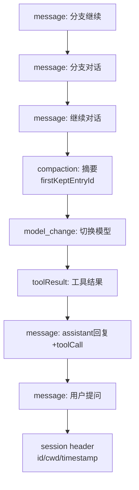
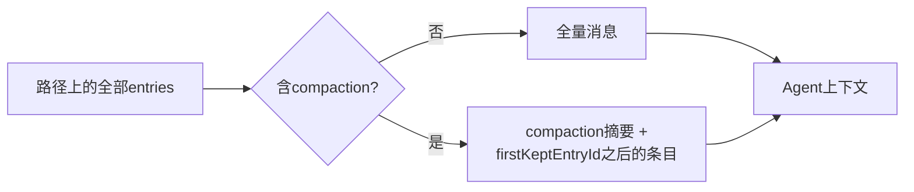
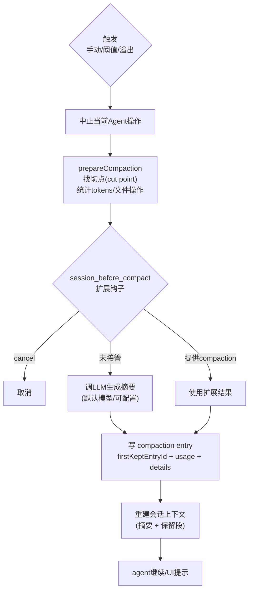
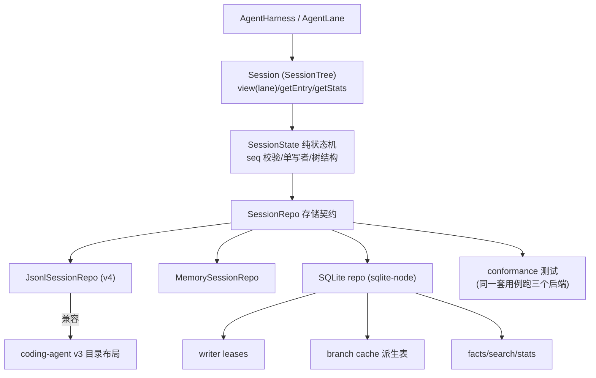

# 4. 会话持久化、压缩与重试

## 4.1 存储位置与格式

- 会话是 **JSONL** 文件，每行一个 JSON entry，追加写（`appendFileSync`）；
- 默认位置：`~/.pi/agent/sessions/--<cwd 转义>--/<timestamp>_<uuid>.jsonl`；
- 文件头是 `session` entry（`id`/`cwd`/`timestamp`/`version`）；
- 当前版本 v3（`CURRENT_SESSION_VERSION = 3`，`packages/coding-agent/src/core/session-manager.ts:30`），加载时自动迁移（v1→v2 加树结构，v2→v3 把 `hookMessage` 角色改名为 `custom`，`session-manager.ts:231`/`260`）。

## 4.2 Entry 类型

| 类型 | 作用 | 是否进入 LLM 上下文 |
|---|---|---|
| `message` | user/assistant/toolResult 消息 | 是 |
| `custom_message` | 扩展注入的上下文消息 | 是（转为 custom 消息） |
| `compaction` | 压缩摘要（含 `firstKeptEntryId`、token 数、usage） | 是（摘要代替被压缩部分） |
| `branch_summary` | 分支切换时的摘要 | 是（摘要代替旧分支） |
| `model_change` / `thinking_level_change` | 模型/思考级别变更 | 否（重建状态用） |
| `custom` | 扩展私有数据（不参与上下文） | 否 |
| `label` / `session_info` | 书签 / 会话名等元数据 | 否 |

## 4.3 树结构与分支

- 每个 entry 有 `id`（8 位随机）+ `parentId`（指向前驱），构成树；
- 当前"叶子"即会话位置；`/tree` 可跳到任意历史节点继续（产生新分支）；
- `/fork` 从任意历史消息派生新会话文件；`/clone` 在当前叶子复制新会话；
- `SessionManager` 负责叶子指针管理、分支路径构建（`buildSessionPath`）、标签（`label`）。

源码对应：`buildSessionContext()`（`session-manager.ts:461`，叶子回溯 + `sessionEntryToContextMessages` 转换）、`sessionEntryToContextMessages`（`session-manager.ts:383`）、compaction 的 `firstKeptEntryId`（`session-manager.ts:72`、`1099`）。

## 4.4 上下文重建

`buildSessionContext()` 从当前叶子回溯到根，沿途收集 `model_change`/`thinking_level_change` 得到状态，再把路径条目经 `sessionEntryToContextMessages` 转为消息。遇到 `compaction` 时：

即压缩只保留"摘要 + 保留起点之后的对话"，旧消息从上下文消失但仍在 JSONL 中（可回溯/恢复）。

## 4.5 压缩（Compaction）

### 三种触发方式

| 触发 | 时机 | 说明 |
|---|---|---|
| 手动 | `/compact` 命令 | 中止当前操作 → 准备 → 生成摘要 → 写 entry |
| 阈值自动 | `agent_end` 后 | 按 token 阈值（`shouldCompact`）判断，自动执行 |
| 溢出恢复 | LLM 返回上下文溢出错误 | 自动压缩后重试失败提示（防重入：`_overflowRecoveryAttempted`） |

### 流程

特点：

- 摘要生成使用独立 LLM 调用（`compact()`），支持重试（`summarization_retry_*` 事件）；
- `details` 记录文件操作（`readFiles`/`modifiedFiles`），压缩后模型仍知道哪些文件已读/已改；
- 扩展可通过 `session_before_compact` 完全接管（主题化压缩、代码感知摘要、不同模型）；
- 压缩结果持久化为 `compaction` entry，是上下文树的一部分，可被后续压缩再次作为输入。

触发点源码：手动 `compact()`（`packages/coding-agent/src/core/agent-session.ts:1864`）；阈值/溢出 `_checkCompaction`（`agent-session.ts:2050`，overflow 分支 `2087`/`2119`、threshold 分支 `2151`）；`_handlePostAgentRun`（`agent-session.ts:1088`）在 `agent_end` 后串起 retry→compact→队列 continue 的收尾链。

## 4.6 自动重试

- 触发条件：`agent_end` 时最后一条 assistant 消息 `stopReason === "error"` 且错误可重试（网络、限流、瞬时 5xx 等，`isRetryableAssistantError`）；
- 受设置约束：`retry.enabled`、`maxRetries`、退避延迟；
- 流程：`agent_end`（带 `willRetry: true`）→ `auto_retry_start` → `agent.continue()` 再次发起 → 成功则 `auto_retry_end(success: true)`，否则达到上限后 `auto_retry_end(success: false)`；
- UI 有 `RetryStatusIndicator` 显示进度，可按 Escape 中止。

## 4.7 会话生命周期操作

| 操作 | 入口 | 行为 |
|---|---|---|
| 新建 | `SessionManager.create` | 新 JSONL + header |
| 继续 | `--continue` / `SessionManager.continueRecent` | 打开最近的会话 |
| 恢复 | `--session` / `/resume` | 按 id/路径打开，跨项目时提示 fork |
| 分叉 | `--fork` / `/fork` | 从历史条目派生新文件（`parentSession` 记录来源） |
| 切换分支 | `/tree` | 移动叶子指针，必要时生成 `branch_summary` |
| 导入/导出 | `/import` `/export` | JSONL 导入恢复、HTML 导出 |
| 清理 | `/session` + Ctrl+D | 删除会话（优先用 trash） |

## 4.8 新一代 durable session（agent-core harness）

与 4.1-4.7 的 `SessionManager`（JSONL v3）并行，`packages/agent/src/harness/session/` 定义了第二代会话模型，面向崩溃恢复、多后端一致性：

关键差异：

| 维度 | 产品层 SessionManager (v3) | durable Session/SessionRepo (v4+) |
|---|---|---|
| 存储单元 | 单流 entries（树形 parentId） | entries + **records 操作日志**双写 |
| 恢复 | 内存重建（`buildSessionContext`） | 日志切片 + `RecordLogCorruption` 校验，`resume()` 挂起/恢复 |
| 并发写 | 单进程单会话 | 单写者 seq 协议 + SQLite writer leases |
| 后端 | 仅 JSONL | JSONL v4 / memory / SQLite（可插拔） |
| 用途 | CLI/UI 产品栈 | 下一代 harness（脚手架）与未来远程/多进程场景 |

实现位置：

- `Session`（`packages/agent/src/harness/session/session.ts`）与纯状态机 `SessionState`（`session/state.ts`，`applyMutation` 拒绝非连续 seq）；
- `SessionRepo` 契约（`session/types.ts`，含 `SessionStorage`/`SessionTree`/`LaneRecord`/`SessionStats`/`SessionSearch`）；
- JSONL v4 后端（`session/jsonl/repo.ts`，头部 `JsonlV4Header` 含 `parentSessionId`，见 `session/jsonl/types.ts`；目录布局兼容 coding-agent v3 的 `--cwd--` 编码，`repo.ts` 的 `jsonlSessionDirectoryName`）；
- SQLite 后端（`packages/session-backends/sqlite-node/src/sqlite/`）：`sessions`/`entries`/`session_sequences`/`session_stats` 表 + `branch_entries` 派生缓存 + `writer_leases` + search（`migrations/001_initial.sql`）；
- 会话搜索：`packages/agent/src/search/scanning.ts`（`SessionSearch.search()` 异步迭代命中）。
