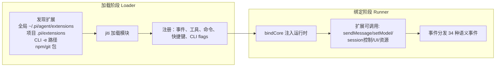
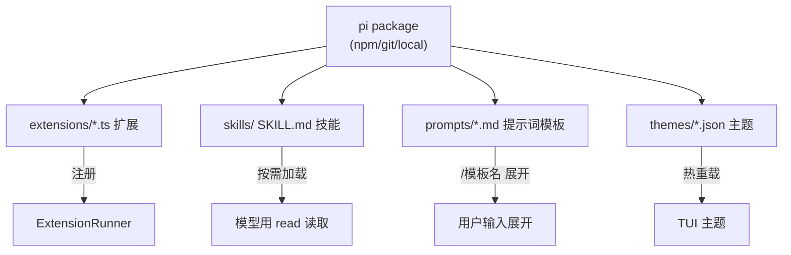
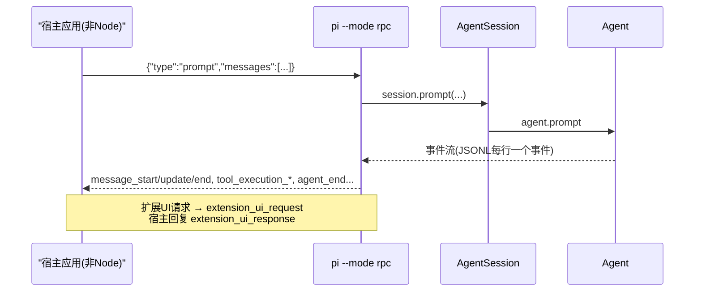

# 5. 扩展系统与运行模式

## 5.1 扩展系统（两阶段架构）

为什么两阶段：

- **Loader 只做声明**：加载期不能调用运行时 API（避免循环依赖和加载副作用），只能 `pi.on(...)`、`pi.registerTool(...)`、`pi.registerCommand(...)`；
- **Runner 负责注入**：`bindCore()` 把真实实现（session、modelRuntime、UI 上下文）注入，扩展获得完整的 `ctx` 能力；
- 扩展可随时 `ctx.reload()` 热重载（重载后旧 ctx 失效，需用新 ctx）。

源码：Loader 入口 `loadExtensions`（`packages/coding-agent/src/core/extensions/loader.ts:587`，支持缓存变体 `loadExtensionsCached`）；Runner `ExtensionRunner`（`extensions/runner.ts:268`）。

## 5.2 扩展事件类型（36 种）

事件类型定义在 `packages/coding-agent/src/core/extensions/types.ts`，类型定义中共出现 36 个 `type` 字符串，其中 **34 种是语义事件**（另 2 个 `boolean`/`string` 是 typebox schema 属性）：

| 分组 | 事件 |
|---|---|
| 会话生命周期 | `session_start`、`session_shutdown`、`session_info_changed` |
| Agent 生命周期 | `agent_start`、`agent_end`、`agent_settled`、`before_agent_start` |
| turn/消息 | `turn_start`、`turn_end`、`message_start`、`message_update`、`message_end` |
| 工具 | `tool_call`、`tool_result`、`tool_execution_start`、`tool_execution_update`、`tool_execution_end` |
| 输入/上下文 | `input`、`context`、`user_bash`、`resources_discover` |
| provider | `before_provider_request`、`after_provider_response`、`before_provider_headers` |
| 模型/思考 | `model_select`、`thinking_level_select` |
| 压缩 | `session_before_compact`、`session_compact`、`session_compact_failed` |
| 会话导航 | `session_before_fork`、`session_before_switch`、`session_before_tree`、`session_tree` |
| 信任/元数据 | `project_trust` |

典型用法：

| 需求 | 事件/接口 |
|---|---|
| 权限门（拦截危险 bash） | `tool_call` 返回 `{ block: true, reason }` |
| 注入每轮上下文（RAG/记忆） | `before_agent_start` 返回 custom messages |
| 转换用户输入 | `input` 返回 `{ action: "transform", text }` |
| 自定义压缩 | `session_before_compact` 返回 `{ compaction }` |
| 自定义 UI | `uiContext`（对话框、状态、widget、编辑器） |
| 自定义 slash 命令 | `pi.registerCommand` |
| 自定义提供商 | `pi.registerProvider`（`custom-provider.md`） |

### 扩展 API 面（ExtensionAPI）

`packages/coding-agent/src/core/extensions/types.ts` 定义的运行时 API 可归纳为：

| 类别 | 能力 |
|---|---|
| 事件 | `pi.on(type, listener)` 订阅上表 34 种事件 |
| 工具 | `pi.registerTool(definition)`（参数 schema 用 typebox `Static<TSchema>` 强类型） |
| 命令/快捷键/CLI | `pi.registerCommand(name, handler)`、`pi.registerShortcut(keyId, ...)`、`pi.registerFlag(name, ...)` |
| provider | `pi.registerProvider(...)`（模型目录/认证/流实现）、`pi.registerTheme(...)` |
| 会话控制 | `ctx.session`（prompt/steer/followUp/compact/abort/model/thinking）、`ctx.modelRuntime` |
| UI 原语 | `ui.select/confirm/input/editor`、widget（`aboveEditor`/`belowEditor`）、footer、status、autocomplete、custom editor、working indicator、terminal input 钩子；`dialogCapable` 标识是否支持对话框式 UI |
| 资源 | `ctx.resourceLoader`（扩展/技能/模板/主题重载）、`ctx.settingsManager` |
| 执行 | `ctx.exec`（受控子进程）、`ctx.executeBash`（bash 结果流式返回） |

UI 上下文是"每模式实现"：interactive、rpc、print 各自提供 `ExtensionUIContext` 实现，扩展代码无需感知终端细节（`types.ts` 中 `ExtensionUIContext` 注释）。

## 5.3 资源体系

- **Skills**：遵循 Agent Skills 标准，`/skill:name` 展开或由模型按需读取；`<skill>` 块注入提示，不占常驻上下文（progressive disclosure，保护提示词缓存）；
- **Prompt templates**：Markdown 文件，`/template args` 展开，支持变量替换；
- **Themes**：JSON 主题，运行时热重载（文件 watcher）；
- **Packages**：以上四类打包分发，`pi install npm:@scope/pkg` / `git:...` / 本地路径；全局 `~/.pi/agent/settings.json` 与项目 `.pi/settings.json` 可分层配置，项目可覆盖全局。

## 5.4 四种运行模式

| 模式 | 入口 | 特性 |
|---|---|---|
| Interactive | `pi` | 全功能 TUI：编辑框、markdown/mermaid 渲染、图片（Kitty/iTerm2）、/命令、Ctrl+P 换模型、Ctrl+L 选择模型、粘贴图片、文件拖放 |
| Print | `pi -p "..."` | 一次性问答，文本输出 |
| JSON | `pi --mode json` | 一次性问答，JSON 事件流输出 |
| RPC | `pi --mode rpc` | stdin/stdout JSONL 协议，非 Node 宿主嵌入（扩展 UI 通过 `extension_ui_request` 回传） |

RPC 命令面（`packages/coding-agent/src/modes/rpc/rpc-types.ts`，远比"prompt 一次问答"丰富）：

- **提示与干预**：`prompt`（`streamingBehavior: "steer" | "followUp"`）、`steer`、`follow_up`、`abort`、`new_session`；
- **模型/思考**：`set_model`、`cycle_model`、`get_available_models`、`set_thinking_level`、`cycle_thinking_level`、`get_available_thinking_levels`；
- **队列/压缩/重试**：`set_steering_mode`、`set_follow_up_mode`、`compact`、`set_auto_compaction`、`set_auto_retry`、`abort_retry`；
- **会话**：`get_state`、`get_session_stats`、`export_html`、`switch_session`、`fork`、`clone`、`get_fork_messages`、`get_entries`、`get_tree`、`get_messages`、`get_last_assistant_text`、`set_session_name`；
- **bash**：`bash`（可 `excludeFromContext`）、`abort_bash`；
- **命令发现**：`get_commands`（extension/prompt/skill 三类来源）。

另有实验性的远程会话栈：

该栈目前标注 experimental，用于未来多进程/远程场景（`packages/server` 的 README 明确 "experimental server package for pi"）。

### 实验性 CLI 子命令（`packages/coding-agent/src/cli/experimental/`）

除了 `--mode rpc`，本快照新增了 `pi client` / `pi server` 子命令框架（`cli/experimental/commands/client.ts`、`server.ts`）：

- `pi server --listen <addr>`：启动远程会话服务（Unix socket 等传输，`transportOption` 支持多地址）；
- `pi client --connect <addr>`：连接远程服务（可带 `--auth-token` / `--auth-token-file`）；
- 底层协议仍是 `pi-protocol`（CBOR 帧 + typebox schema 校验，`packages/protocol/src/codec.ts:60-85`）+ `pi-server`（连接/会话/快照广播，`packages/server/src/`）。

这两条命令与 `pi-client`/`pi-server` 包共同构成"远程 Agent 会话"的实验方向，当前不作为稳定接口承诺。

## 5.5 内置 slash 命令

`/settings`、`/model`、`/scoped-models`、`/export`、`/import`、`/share`、`/copy`、`/name`、`/session`、`/changelog`、`/hotkeys`、`/fork`、`/clone`、`/tree`、`/trust`、`/login`、`/logout`、`/new`、`/compact`、`/resume`、`/reload`、`/quit`；另有 `!command` 直接执行 bash（`!!` 不带上下文）。
