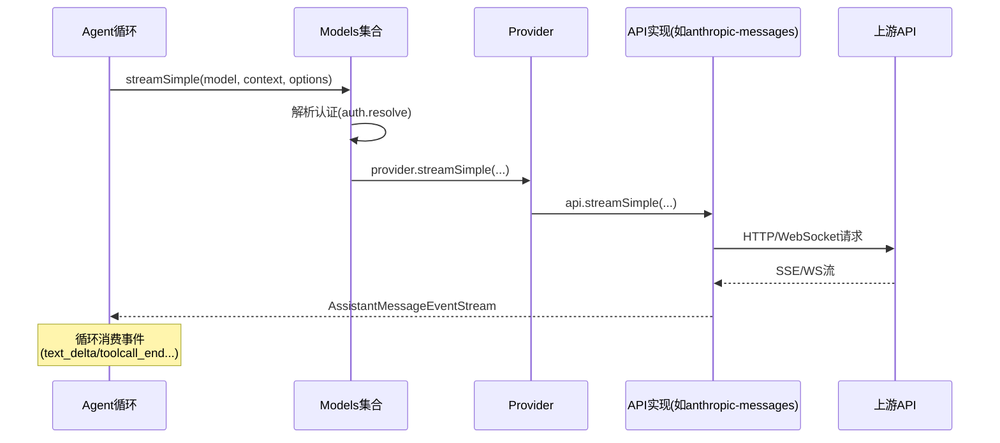
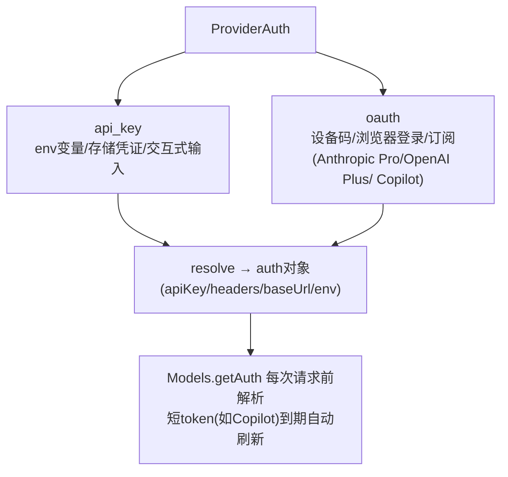

# 6. pi-ai 提供商抽象与模型管理

## 6.1 统一消息与事件流

所有 provider 的输出被归一化为同一结构：

- `Message`：`UserMessage`（text/image 内容块）、`AssistantMessage`（text/thinking/toolCall 内容块 + usage + stopReason）、`ToolResultMessage`（toolCallId + content + isError）；
- `AssistantMessageEventStream`：`start` → 增量事件（`text_delta`/`thinking_delta`/`toolcall_delta`...）→ `done`（成功）或 `error`（失败/中止）；
- 流式协议保证：失败**不抛异常**，而是以 `stopReason: "error"/"aborted"` 的最终消息终止流——这是上层 Agent 循环能稳定运行的契约基础。



## 6.2 Provider / Models 抽象

### Provider（单一运行时单元）

```ts
interface Provider {
  id: string;
  name: string;
  baseUrl?: string;
  headers?: ProviderHeaders;
  auth: ProviderAuth;                    // api_key 或 oauth
  getModels(): Model[];                  // 同步目录（静态+动态合并）
  refreshModels?(ctx): Promise<void>;    // 动态刷新（可持久化到 models-store）
  filterModels?(models, credential);     // 按凭证过滤可用模型
  stream(model, context, options);       // 完整流
  streamSimple(model, context, options); // 简化流（含 reasoning/toolChoice）
  fetchDeferred? / cancelDeferred?;      // 异步长任务
}
```

`createProvider()` 把"定义"转为 Provider：静态 `models` 数组 + 可选 `fetchModels` 动态覆盖 + `api`（单个实现或按 `model.api` 分发的 map）。内置 provider 工厂（如 `anthropicProvider()`）只是声明式配置：

```ts
return createProvider({
  id: "anthropic",
  baseUrl: "https://api.anthropic.com",
  auth: { apiKey: anthropicApiKeyAuth(), oauth: lazyOAuth({...}) },
  models: Object.values(ANTHROPIC_MODELS),
  api: anthropicMessagesApi(),   // 懒加载实现
});
```

源码位置：`Provider` 接口（`packages/ai/src/models.ts:97`）、`Models` 集合（`models.ts:156`）、`createProvider`（`models.ts:762`，含动态模型 overlay 的事务性恢复/发布）、`getAvailable`（`models.ts:522`）、`streamSimple`（`models.ts:690`）、`calculateCost`（`models.ts:878`）、`clampThinkingLevel`（`models.ts:913`）。

本快照 `packages/ai/src/providers/` 下共 86 个 `.ts` 文件，其中约 45 个 provider 工厂/注册文件（其余为 `*.models.ts` 静态目录与 `all.ts` 聚合）；工厂按 `id` 注册进 `providers/all.ts`，供 `ModelRuntime`（`packages/coding-agent/src/core/model-runtime.ts:130`）以快照形式暴露 `all`/`available`/`configuredProviders`。

### Models 集合

`Models` 是多个 Provider 的组合，职责：

- 认证解析与持久化：`getAuth`（按 provider 或 model）、`login`/`logout`、OAuth 令牌刷新；
- 可用性：`checkAuth` / `getAvailable`（只返回"已配置认证"的 provider 的模型）；
- 模型目录刷新：`refresh()` 并发刷新所有动态 provider，先恢复本地缓存再按需联网（离线模式 `allowNetwork: false`）；
- 统一请求：`stream`/`complete`/`streamSimple`/`completeSimple`，在调用前合并 auth、headers、env、baseUrl 覆盖；
- 成本与思考级别：`calculateCost`（含分级定价与 Anthropic 长缓存双倍计费）、`getSupportedThinkingLevels`/`clampThinkingLevel`。

## 6.3 认证模型



- 凭证存储：`CredentialStore` 接口，默认文件 `~/.pi/agent/auth.json`（Node），Bun 用 `bun-oauth.ts`；
- 每次请求前解析（`getApiKey` 钩子也支持动态刷新），因为 OAuth token 可能在长工具执行期间过期；
- `models.json` 可为 provider 配置 baseUrl、headers、oauth 类型（radius 网关等）。

实现：`CredentialStore` 接口与类型（`packages/ai/src/auth/types.ts:65`）、默认 `InMemoryCredentialStore`（`packages/ai/src/auth/credential-store.ts:12`，应用注入持久化实现）、OAuth 设备码/PKCE/浏览器页（`auth/oauth/device-code.ts`、`pkce.ts`、`oauth-page.ts`）、provider 专属 OAuth（anthropic/openai-codex/github-copilot/kimi/xai/radius 等 `auth/oauth/*.ts`）、`getApiKey` 每轮解析钩子（`packages/agent/src/types.ts` AgentLoopConfig）。

## 6.4 模型目录

- 静态目录：`src/providers/*.models.ts`，由脚本 `generate-models.ts` 从上游目录生成（`models.generated.ts` 禁止手改，需改生成脚本后重新生成）；
- 动态目录：provider 的 `fetchModels` 联网刷新，结果持久化到 `models-store.json`；
- `ModelRuntime`（coding-agent 层）把这些包装成快照：`all`/`available`/`configuredProviders`/`auth`，供模型选择器（Ctrl+P/L）与 CLI 使用；
- 远端目录：`withRemoteCatalog` 支持从 pi.dev 拉取 model catalog（`remote-catalog-provider.ts`）。

仓库脚本链：`generate:models`（`packages/ai/scripts/generate-models.ts` + `generate-image-models.ts`）、`hydrate:model-data`、`generate:model-catalog` + `diff:model-catalog`/`check:model-catalog`（`scripts/publish-model-catalog.mjs`），保证模型元数据可审计、可离线构建（`build:offline`）。

## 6.5 流式选项亮点

| 选项 | 说明 |
|---|---|
| `reasoning` / `thinkingBudgets` | 思考级别映射到各 provider 的 effort/budget 字段（thinking level map） |
| `cacheRetention` | 提示缓存保留策略（"short"/"long"，Anthropic 缓存标记、OpenAI 显式缓存模式） |
| `sessionId` | 会话亲和头/body 字段（提示缓存路由到同一副本） |
| `transport` | "sse"/"websocket"/"websocket-cached"/"auto" |
| `deferred` | 长任务异步化：返回 `DeferredHandle`，稍后 `fetchDeferred` 取结果（如 OpenAI 批处理类） |
| `timeoutMs` / `maxRetries` / `maxRetryDelayMs` | 超时与重试控制（`provider-retry.ts` 可响应服务端建议的等待时间） |
| `samplingParams` | 透传自定义采样参数（top_p/top_k 等，供 llama.cpp/vLLM 等本地服务） |
| `onPayload` / `onResponse` / `transformHeaders` | 请求前后钩子（扩展系统用来注入 provider 归属头、观测） |

## 6.6 懒加载与树摇

- `api/*.lazy.ts` 包装实现，`lazyStream()` 在真正发起请求时才加载对应 SDK（OpenAI/Anthropic/Google SDK 体积大，启动时零加载）；
- `index.ts` 只导出类型与核心（无副作用），provider 工厂与 API 实现通过子路径导出（`@earendil-works/pi-ai/providers/*`、`/api/*`）；
- 这是"启动快"的关键设计之一（与 TUI 的差分渲染配合）。
