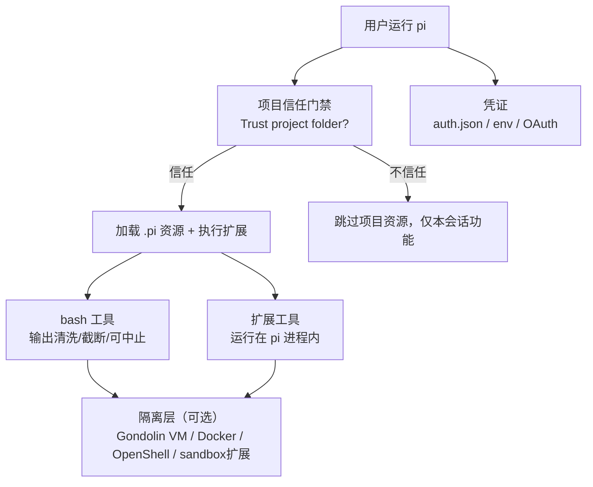
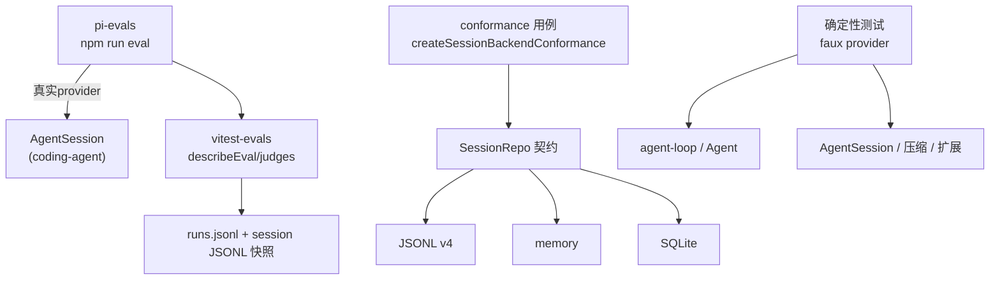

# 7. 安全、权限与测试

> 快照：commit `c49906ec7`。代码路径相对 `../pi`。安全与评估两个主题合并在本文；网上资料对照作为附录放在末尾。

## 7.1 权限模型总览

PI 的定位是"模型代码与你的 shell 同权限"：**没有逐工具权限弹窗/审批流**，默认以启动用户的权限运行（根 README "Permissions & Containerization" 与 `SECURITY.md` 原文）。它的安全面由四层构成：

## 7.2 项目信任门禁（内置）

触发条件（`packages/coding-agent/src/core/trust-manager.ts:30` 的 `TRUST_REQUIRING_PROJECT_CONFIG_RESOURCES`）：项目含 `.pi/settings.json`、`.pi/extensions`、`.pi/skills`、`.pi/prompts`、`.pi/themes`、`SYSTEM.md`、`APPEND_SYSTEM.md` 任一资源。

- 弹出 "Trust project folder?" 选择（`packages/coding-agent/src/core/project-trust.ts:46` 的 `resolveProjectTrusted`）：信任 / 信任父目录 / 仅本次信任 / 不信任 / 仅本次不信任（`trust-manager.ts` 的 `getProjectTrustOptions`）；
- 信任决策持久化到 trust store（`proper-lockfile` 加锁写入），支持按目录逐级查找最近祖先决策（`findNearestTrustEntry`）；
- 设置项 `defaultProjectTrust`（默认 `"ask"`，仅全局可配，`packages/coding-agent/src/core/settings-manager.ts:109`）；`/trust` 命令可重选；
- 扩展可监听 `project_trust` 事件参与决策（`packages/coding-agent/src/core/extensions/runner.ts` 的 `emitProjectTrustEvent`）；
- **不信任时**：不加载项目 settings/扩展/skills 等资源、不安装项目包、不执行项目扩展——这是"信任边界"，与"逐命令权限审批"不同。

## 7.3 bash 与输出安全

- **输出卫生**：`packages/coding-agent/src/core/bash-executor.ts:19` 起统一处理：剥离 ANSI、替换二进制垃圾、归一化换行（`sanitizeBinaryOutput`/`stripAnsi`）；超 `DEFAULT_MAX_BYTES` 后转写临时文件并保留完整日志路径（`fullOutputPath`），返回给模型的只留截断滚动缓冲；
- **可中止**：`signal` 传播到子进程；`executeBashWithOperations` 支持远程/容器 operations（SSH、容器），便于沙箱化；
- **RPC 协议卫生**：`output-guard.ts` 的 `takeOverStdout` 把杂散 stdout 写重定向到 stderr，保证 rpc/json 模式的 stdout 只含协议帧（`packages/coding-agent/src/modes/rpc/rpc-mode.ts:55`、`main.ts:634`）；
- **扩展提供的防护示例**：`examples/extensions/permission-gate.ts`（拦截危险命令）、`confirm-destructive.ts`、`protected-paths.ts`、`dirty-repo-guard.ts`、`bash-spawn-hook.ts`——均通过 `tool_call` / `input` / `user_bash` 事件实现，证明"权限门"是可扩展的而非内置。

## 7.4 沙箱与隔离（官方推荐路径）

`packages/coding-agent/docs/containerization.md` 给出三种模式：

| 模式 | 隔离范围 | 说明 |
|---|---|---|
| **Gondolin 扩展** | 内置工具 + `!` 命令进本地 Linux 微 VM | pi 与 provider 凭证留在宿主，`read/write/edit/bash/grep/find/ls` 全部路由进 VM（`examples/extensions/gondolin/`） |
| **Plain Docker** | 整个 pi 进程 | 简单隔离，但 provider API key 会进入容器 |
| **OpenShell** | 整个 pi 进程 | 策略受控沙箱，本地或远程网关 |

另有 `examples/extensions/sandbox/`：基于 `@anthropic-ai/sandbox-runtime` 在 OS 层限制 bash（macOS `sandbox-exec`、Linux `bubblewrap`），支持域名白/黑名单、文件系统读写策略，配置按全局/项目合并（`~/.pi/agent/extensions/sandbox.json` + `.pi/sandbox.json`）。

注意：**扩展工具运行在 pi 进程内**，只有被扩展路由到沙箱的操作才隔离；这是安全模型的核心边界（README 明确 "Extensions run wherever the pi process runs"）。

## 7.5 凭证处理

- 存储：`AuthStorage` 默认文件 `~/.pi/agent/auth.json`（`packages/coding-agent/src/core/auth-storage.ts:52`，`FileAuthStorageBackend`）；`CredentialStore` 接口在 `packages/ai/src/auth/types.ts:65`，pi-ai 侧默认 `InMemoryCredentialStore`（应用注入持久化实现，`packages/ai/src/auth/credential-store.ts:12`）；
- 类型：每 provider 一个 type-tagged credential（API key / OAuth），`auth.json` 即该形状（`packages/ai/src/auth/types.ts:36`）；
- API key 还可来自环境变量（`packages/ai/src/env-api-keys.ts`）或交互式输入；`models.json` 可为 provider 配置 baseUrl/headers/oauth 类型；
- OAuth：设备码（`auth/oauth/device-code.ts`）、PKCE（`auth/oauth/pkce.ts`）、浏览器授权页（`auth/oauth/oauth-page.ts`），Anthropic Pro / OpenAI Plus / GitHub Copilot / Kimi / xAI / radius 各有专属实现（`auth/oauth/*.ts`）；短 token（如 Copilot）**每次请求前解析**（`AgentLoopConfig.getApiKey`，`packages/agent/src/types.ts`），避免长工具执行期间过期；
- 认证解析在每次请求前合并 auth、headers、env、baseUrl 覆盖（`packages/ai/src/models.ts` `streamSimple` 路径），`checkAuth`/`getAvailable` 只暴露"已配置认证"的模型。

## 7.6 供应链安全（源码内可验证）

根 README "Supply-chain hardening" 与 AGENTS.md 是事实基准：

- 直接外部依赖**精确锁版本**（`package-lock.json` 为 ground truth；`.npmrc` 设 `save-exact=true` 与 `min-release-age=2`）；
- 预提交阻止意外 lockfile 变更（除非 `PI_ALLOW_LOCKFILE_CHANGE=1`）；
- 发布 CLI 包带 `packages/coding-agent/npm-shrinkwrap.json`（从根 lockfile 生成，`scripts/generate-coding-agent-shrinkwrap.mjs`），锁住传递依赖；生成脚本对**生命周期脚本依赖有显式 allowlist**，新生命周期脚本依赖必须评审；
- CI 用 `npm ci --ignore-scripts`，定时 workflow 跑 `npm audit --omit=dev` + `npm audit signatures --omit=dev`；
- 发布前 `release:local` 在仓库外做隔离安装冒烟；本地安装/`pi update --self` 用 `--ignore-scripts`；
- `npm run check` 链含 `check:pinned-deps`、`check:shrinkwrap`、`check:install-lock:coding-agent`、`check:ts-imports`（原生 TS import 兼容）与浏览器冒烟（`scripts/check-browser-smoke.mjs`）。

## 7.7 评估体系总览

PI 的"如何证明 harness 是对的"分三层：

1. **行为评估（pi-evals）**：真实模型 + 真实 `AgentSession` 跑场景，基于 `vitest-evals` 出报告（`packages/evals/`）；
2. **契约一致性（conformance）**：同一套 `SessionRepo` 用例跑 JSONL/memory/SQLite 三个后端（`packages/agent/src/harness/session/testing/conformance.ts` + `packages/session-backends/sqlite-node/test/conformance.test.ts`）；
3. **确定性测试**：faux provider 驱动循环/会话/压缩/扩展的单元与集成测试（`packages/agent/test`、`packages/coding-agent/test`、`packages/ai/test`）。

## 7.8 行为评估：pi-evals

`packages/evals/README.md` 明确定位："behavioral, model-backed checks for Pi workflows"，即**模型背书的行为评估**，不是单元测试：

- 运行：`npm run eval -- --provider openai --model gpt-5.6-sol`（或 `PI_PROVIDER`/`PI_MODEL` 环境变量；provider 与 model 必须成对给出），CLI 值优先，参数透传 Vitest（`packages/evals/scripts/run-evals.mjs:22` 起解析 `--provider/--model`）。
- 认证复用 `ModelRuntime` 正常链路（API key 环境变量、Pi 订阅 OAuth 等）。
- 产物：每次运行生成 `.eval/<timestamp>_<uuid>/`，`runs.jsonl` 索引 + `sessions/` 下原生 pi 会话 JSONL 附件（`packages/evals/README.md`；`.gitignore` 忽略）。
- `createPiCodingAgentHarness(...)` 适配真实 `AgentSession`（`packages/evals/src/pi-harness.ts:246`），选项：`name`、`model: {provider, id}`、`noTools: "all"|"builtin"`、`transformSystemPrompt`、`output`（把 response+session 转成 JSON-safe 域结果）。
- 场景用 `describeEval` + `it` 声明，断言在 `result.output`（应用行为）与 `result.session`（模型/工具 trace）上；`expect` 硬断言只用于基础设施不变量。
- 支持**多步输入**：`run([{type:"prompt",...}, {type:"reload"}, {type:"prompt",...}])`，reload 用于"先创建扩展再使用扩展"这类场景（README）。
- **对比评估**：`evalHarnessTable(...)`（`packages/evals/src/vitest-evals/harness-table.ts:157`）以 baseline + candidate(s) + repetitions 生成 `describe.for(...)` 表格；judge 打分（确定性或模型背书），`judgeThreshold: null` 让低分只是观察而非失败；reporter 计算 pass-rate lift（candidate 通过率 − baseline 通过率，百分点）与 tokens/latency/cost 配对增量（`packages/evals/src/vitest-evals/reporter.ts`、`summary.ts`）。
- 分组键：repetition + 非空 `input.id`，否则输入 SHA-256（`harness-table.ts` 的 `deriveInputKey`）。

现有场景（快照）：`smoke.eval.ts`（基础问答端到端 + usage 断言）、`extensions.eval.ts`（引导模型写扩展→reload→使用扩展，用 judge 与 harness table 对比系统提示词变体对扩展创作成功率的影响）。

## 7.9 契约一致性：session conformance

- `createSessionBackendConformance(factory)` 生成一组**后端无关用例**（`packages/agent/src/harness/session/testing/conformance.ts:92`）：parent/seq 分配、lane 创建与移动、records 追加、facts（name/label）、并发/幂等、错误码等；
- JSONL v4 后端有自己的编解码/存储/搜索测试（`packages/agent/test/harness/session/{jsonl,jsonl-codec,jsonl-storage,memory,search}.test.ts`）；
- SQLite 后端跑同一套 conformance（`packages/session-backends/sqlite-node/test/conformance.test.ts`），外加 adapter/branch-cache/branch-query/facts/log/repository/search/writer-leases/migrations 专项测试（`packages/session-backends/sqlite-node/test/` 共 12 个 `.ts`，含 1 个 `test-utils.ts` helper）；
- 这是"多后端同一行为"的工程保证：未来换存储不改 harness 语义。

## 7.10 确定性测试：faux provider 与测试分层

`packages/ai/src/providers/faux.ts` 是确定性模型：可编排 `FauxResponseStep`（文本/思考/工具调用），`registerFauxProvider` + `streamSimple` 在 `@earendil-works/pi-ai/compat` 导出，让循环/会话测试**不依赖任何真实 API**。仓库规则（AGENTS.md）：coding-agent 新测试一律用 `test/suite/harness.ts` + faux provider，禁止真实 provider key 或付费 token。

| 层 | 位置 | 覆盖 |
|---|---|---|
| agent-core 循环/工具 | `packages/agent/test/agent-loop.test.ts`、`agent.test.ts`、`proxy.test.ts` | 队列、事件顺序、tool batch、abort |
| agent-core harness | `packages/agent/test/harness/`（compaction、branch-summarization、reducer、events、telemetry、tools、session/*） | 新一代 durable harness 各部件 |
| coding-agent 会话/压缩/扩展 | `packages/coding-agent/test/agent-session-*.test.ts`（branching/compaction/retry/queue/dynamic-tools/stats/tree-navigation…） | 产品层行为 |
| coding-agent suite（新规范） | `packages/coding-agent/test/suite/`（harness.ts + `regressions/<issue>-<slug>.test.ts`） | 回归场景按 issue 编号沉淀（如 `2835-tools-allowlist-filters-extension-tools`、`3303-find-nested-gitignore`） |
| ai 提供商兼容 | `packages/ai/test/`（anthropic-*、bedrock-*、openai-*、cache-retention、context-estimate、faux-provider…） | 每家的消息转换/认证/流协议/成本 |
| 脚本级 | 根 `npm run test:scripts`（`scripts/*.test.mjs`）、`pi-test.sh`/`test.bat` | 仓库基建与 CLI 冒烟 |

运行约束（AGENTS.md）：不直接跑全量 vitest（会激活带 endpoint/auth env 的 e2e）；用根 `./test.sh`（跳过 LLM 依赖测试）或按包跑指定文件；TUI 冒烟用 tmux 会话驱动 `./pi-test.sh`；新回归必须落在 `test/suite/regressions/<issue>-<slug>.test.ts` 并跑通。

## 7.11 风险观察

- **默认信任边界较宽**：一旦项目被信任，其扩展是任意代码（等价于项目让你跑脚本）；社区包（pi packages）安装与执行前应视为同等级信任；
- **无逐工具最小权限**：模型可自由调用 bash（除非扩展拦截），依赖"项目信任 + 容器化"兜底；新用户可能误以为有审批流；
- **凭证明文**：`auth.json` 未加密（依赖文件权限），README 也未声称加密；
- **输出清洗是"展示层"防御**：截断/ANSI 清洗保护上下文与 UI，不是命令注入防护；`!` 与 bash 工具直接执行用户/模型给出的命令；
- **测试基建先于实现**：新一代 durable harness 的 reducer/records/conformance 有完整测试，而 `AgentHarness` 运行方法仍是脚手架——演进是"契约先行"；
- **评估贴近真实产品栈**：pi-evals 不 mock 会话，直接复用 `AgentSession`，代价是每个场景都要真实模型 token。

## 附录 A：网上资料对照与生态

> 以下内容来自公开网络资料（2026-08 快照），用于交叉验证源码分析，标注"网上资料"的信息未在本仓库源码中逐一核对。

| 公开资料说法 | 源码验证 |
|---|---|
| "四工具核心：read/write/edit/bash" | 一致：`createCodingTools` 返回 4 个，另有可选只读工具 grep/find/ls（`packages/coding-agent/src/core/tools/index.ts`） |
| "系统提示词 < 1000 token" | 部分一致：`buildSystemPrompt` 刻意精简，工具列表按需注入（有 `toolSnippets` 逐行描述机制，`packages/coding-agent/src/core/system-prompt.ts`） |
| "三层架构：ai → agent → coding-agent" | 完全一致：依赖图单向，coding-agent 是唯一胶水层 |
| "会话是树形 JSONL，支持分支/fork" | 完全一致：`id/parentId` 树 + `buildSessionContext` 叶子回溯 |
| "压缩三触发：手动/阈值/溢出" | 完全一致：`compact()`/`_checkCompaction`/`_overflowRecoveryAttempted` |
| "扩展两阶段：Loader 注册、Runner 绑定" | 完全一致：`extensions/loader.ts` + `extensions/runner.ts`（`bindCore`） |
| "默认无 MCP/子代理/权限弹窗/plan mode" | 一致：这些能力通过扩展事件（`tool_call` 拦截等）实现；注意**项目信任门禁**是内置的（`trust-manager.ts`），与"逐工具权限弹窗"是两回事 |
| "15+ providers、订阅制 OAuth" | 一致：`providers/` 下 86 个 ts 文件（约 45 个工厂/注册文件）；Anthropic Pro/OpenAI Plus/Copilot 走 OAuth 订阅 |
| "AgentHarness 是测试/评估基座" | **不准确**：`AgentHarness` 是新一代 durable harness API（lane/session/records，多数方法 `HarnessNotImplemented`）；`pi-evals` 实际适配 coding-agent `AgentSession`（`packages/evals/src/pi-harness.ts`） |
| "会话只有一套 JSONL" | 不完全：产品层 `SessionManager` v3 之外，agent-core harness 还有 v4 JSONL / memory / SQLite 三后端 + records 日志（见 [04-session.md](./04-session.md) 4.8） |
| "无任何权限防护" | 不完全：无逐工具权限 UI，但 bash 输出有清洗/截断（`bash-executor.ts`），项目资源加载有信任门禁（`project-trust.ts`），沙箱以扩展/容器提供（`examples/extensions/sandbox`、`docs/containerization.md`） |
| "pi 是 libGDX 作者创建、MIT、零后端" | 网上资料；package.json 作者即 Mario Zechner（badlogic） |

生态与周边（网上资料）：**pi-chat**（Slack/聊天自动化）、**pi-share-hf**（会话发布到 Hugging Face）、**oh-my-pi**（社区扩展集合）、**OpenClaw**（SDK 嵌入案例）、**pi.dev/packages**（package 市场）、**Gondolin 扩展**（微 VM 隔离）、**learning-pi-agent**（社区中文笔记）；网上中文报道称 star 约 9.3 万（2026-08），未在源码内验证。

## 附录 B：调研方向与参考链接

值得继续深挖的线索：**Provider 抽象与懒加载**（`packages/ai/src/models.ts` + `api/*.lazy.ts`）；**扩展事件模型**（`packages/coding-agent/src/core/extensions/types.ts` 的 34 种语义事件时序）；**Agent 循环并发与取消语义**（`packages/agent/src/agent-loop.ts`）；**压缩质量与文件跟踪**（`packages/coding-agent/src/core/compaction/`）；**TUI 差分渲染**（`packages/tui`）；**远程协议**（`packages/protocol` + `packages/server`）；**durable harness 演进**（`packages/agent/src/harness/` + `packages/evals`）。

参考链接：官网 <https://pi.dev>；源码 <https://github.com/earendil-works/pi>（本仓库即其镜像）；npm `@earendil-works/pi-coding-agent` / `pi-agent-core` / `pi-ai`；社区会话数据集 <https://huggingface.co/datasets/badlogicgames/pi-mono>；第三方分析 <https://agentic-ai.readthedocs.io/en/latest/AgentHarness/pi-dev/>、<https://github.com/yamsfeer/learning-pi-agent>；容器化 `packages/coding-agent/docs/containerization.md`。

## 附录 C：免责声明

本目录为分析性文档，非官方文档；代码路径与行为以本仓库当前快照（`c49906ec7`）为准，公开资料数据（star 数、release 数等）仅作背景参考，可能滞后于最新状态。
