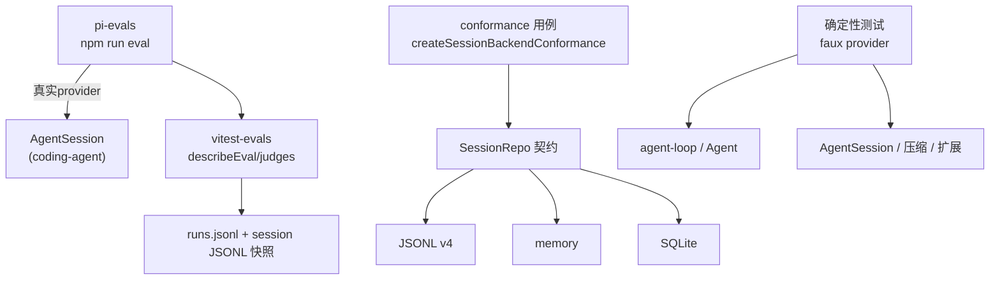

# 8. 评估与测试体系

> 快照：commit `c49906ec7`。代码路径相对 `../pi`。

## 8.1 总览

PI 的"如何证明 harness 是对的"分三层：

1. **行为评估（pi-evals）**：真实模型 + 真实 `AgentSession` 跑场景，基于 `vitest-evals` 出报告（`packages/evals/`）；
2. **契约一致性（conformance）**：同一套 `SessionRepo` 用例跑 JSONL/memory/SQLite 三个后端（`packages/agent/src/harness/session/testing/conformance.ts` + `packages/session-backends/sqlite-node/test/conformance.test.ts`）；
3. **确定性测试**：faux provider 驱动循环/会话/压缩/扩展的单元与集成测试（`packages/agent/test`、`packages/coding-agent/test`、`packages/ai/test`）。

## 8.2 行为评估：pi-evals

### 定位与运行

`packages/evals/README.md` 明确定位："behavioral, model-backed checks for Pi workflows"，即**模型背书的行为评估**，不是单元测试：

- 运行：`npm run eval -- --provider openai --model gpt-5.6-sol`（或 `PI_PROVIDER`/`PI_MODEL` 环境变量；provider 与 model 必须成对给出），CLI 值优先，参数透传 Vitest（`packages/evals/scripts/run-evals.mjs:22` 起解析 `--provider/--model`）。
- 认证复用 `ModelRuntime` 正常链路（API key 环境变量、Pi 订阅 OAuth 等）。
- 产物：每次运行生成 `.eval/<timestamp>_<uuid>/`，`runs.jsonl` 索引 + `sessions/` 下原生 pi 会话 JSONL 附件（`packages/evals/README.md`；`.gitignore` 忽略）。

### 编写方式

- `createPiCodingAgentHarness(...)` 适配真实 `AgentSession`（`packages/evals/src/pi-harness.ts:246`），选项：`name`、`model: {provider, id}`、`noTools: "all"|"builtin"`、`transformSystemPrompt`、`output`（把 response+session 转成 JSON-safe 域结果）。
- 场景用 `describeEval` + `it` 声明，断言在 `result.output`（应用行为）与 `result.session`（模型/工具 trace）上；`expect` 硬断言只用于基础设施不变量。
- 支持**多步输入**：`run([{type:"prompt",...}, {type:"reload"}, {type:"prompt",...}])`，reload 用于"先创建扩展再使用扩展"这类场景（README）。
- **对比评估**：`evalHarnessTable(...)`（`packages/evals/src/vitest-evals/harness-table.ts:157`）以 baseline + candidate(s) + repetitions 生成 `describe.for(...)` 表格；judge 打分（确定性或模型背书），`judgeThreshold: null` 让低分只是观察而非失败；reporter 计算 pass-rate lift（candidate 通过率 − baseline 通过率，百分点）与 tokens/latency/cost 配对增量（`packages/evals/src/vitest-evals/reporter.ts`、`summary.ts`）。
- 分组键：repetition + 非空 `input.id`，否则输入 SHA-256（`harness-table.ts` 的 `deriveInputKey`）。

现有场景（快照）：`smoke.eval.ts`（基础问答端到端 + usage 断言）、`extensions.eval.ts`（引导模型写扩展→reload→使用扩展，用 judge 与 harness table 对比系统提示词变体对扩展创作成功率的影响）。

## 8.3 契约一致性：session conformance

- `createSessionBackendConformance(factory)` 生成一组**后端无关用例**（`packages/agent/src/harness/session/testing/conformance.ts:92`）：parent/seq 分配、lane 创建与移动、records 追加、facts（name/label）、并发/幂等、错误码等；
- JSONL v4 后端有自己的编解码/存储/搜索测试（`packages/agent/test/harness/session/{jsonl,jsonl-codec,jsonl-storage,memory,search}.test.ts`）；
- SQLite 后端跑同一套 conformance（`packages/session-backends/sqlite-node/test/conformance.test.ts`），外加 adapter/branch-cache/branch-query/facts/log/repository/search/writer-leases/migrations 专项测试（`packages/session-backends/sqlite-node/test/` 共 12 个 `.ts`，含 1 个 `test-utils.ts` helper）；
- 这是"多后端同一行为"的工程保证：未来换存储不改 harness 语义。

## 8.4 确定性测试：faux provider 与测试分层

### faux provider

`packages/ai/src/providers/faux.ts` 是确定性模型：可编排 `FauxResponseStep`（文本/思考/工具调用），`registerFauxProvider` + `streamSimple` 在 `@earendil-works/pi-ai/compat` 导出，让循环/会话测试**不依赖任何真实 API**。仓库规则（AGENTS.md）：coding-agent 新测试一律用 `test/suite/harness.ts` + faux provider，禁止真实 provider key 或付费 token。

### 测试文件分布（快照）

| 层 | 位置 | 覆盖 |
|---|---|---|
| agent-core 循环/工具 | `packages/agent/test/agent-loop.test.ts`、`agent.test.ts`、`proxy.test.ts` | 队列、事件顺序、tool batch、abort |
| agent-core harness | `packages/agent/test/harness/`（compaction、branch-summarization、reducer、events、telemetry、tools、session/*） | 新一代 durable harness 各部件 |
| coding-agent 会话/压缩/扩展 | `packages/coding-agent/test/agent-session-*.test.ts`（branching/compaction/retry/queue/dynamic-tools/stats/tree-navigation…） | 产品层行为 |
| coding-agent suite（新规范） | `packages/coding-agent/test/suite/`（harness.ts + `regressions/<issue>-<slug>.test.ts`） | 回归场景按 issue 编号沉淀（如 `2835-tools-allowlist-filters-extension-tools`、`3303-find-nested-gitignore`） |
| ai 提供商兼容 | `packages/ai/test/`（anthropic-*、bedrock-*、openai-*、cache-retention、context-estimate、faux-provider…） | 每家的消息转换/认证/流协议/成本 |
| 脚本级 | 根 `npm run test:scripts`（`scripts/*.test.mjs`）、`pi-test.sh`/`test.bat` | 仓库基建与 CLI 冒烟 |

### 运行约束（AGENTS.md）

- 不直接跑全量 vitest（会激活带 endpoint/auth env 的 e2e）；用根 `./test.sh`（跳过 LLM 依赖测试）或按包跑指定文件；
- TUI 冒烟用 tmux 会话驱动 `./pi-test.sh`；
- 新回归必须落在 `test/suite/regressions/<issue>-<slug>.test.ts` 并跑通。

## 8.5 观察

- **测试基建先于实现**：新一代 durable harness 的 reducer/records/conformance 有完整测试，而 `AgentHarness` 运行方法仍是脚手架——说明演进是"契约先行"；
- **评估贴近真实产品栈**：pi-evals 不 mock 会话，直接复用 `AgentSession`，代价是每个场景都要真实模型 token；
- **多后端 conformance 是亮点**：与 04-session.md 的 v3/v4 双体系对应，是未来会话存储演进的安全网。
