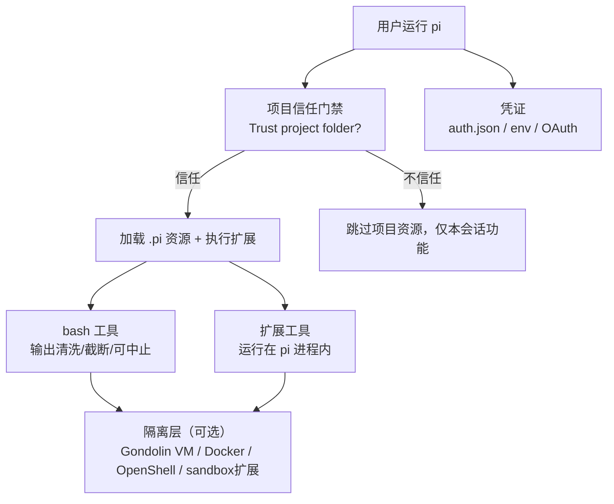

# 9. 安全与权限

> 快照：commit `c49906ec7`。代码路径相对 `../pi`。

## 9.1 权限模型总览

PI 的定位是"模型代码与你的 shell 同权限"：**没有逐工具权限弹窗/审批流**，默认以启动用户的权限运行（根 README "Permissions & Containerization" 与 `SECURITY.md` 原文）。它的安全面由四层构成：

## 9.2 项目信任门禁（内置）

触发条件（`packages/coding-agent/src/core/trust-manager.ts:30` 的 `TRUST_REQUIRING_PROJECT_CONFIG_RESOURCES`）：项目含 `.pi/settings.json`、`.pi/extensions`、`.pi/skills`、`.pi/prompts`、`.pi/themes`、`SYSTEM.md`、`APPEND_SYSTEM.md` 任一资源。

- 弹出 "Trust project folder?" 选择（`packages/coding-agent/src/core/project-trust.ts:46` 的 `resolveProjectTrusted`）：信任 / 信任父目录 / 仅本次信任 / 不信任 / 仅本次不信任（`trust-manager.ts` 的 `getProjectTrustOptions`）；
- 信任决策持久化到 trust store（`proper-lockfile` 加锁写入），支持按目录逐级查找最近祖先决策（`findNearestTrustEntry`）；
- 设置项 `defaultProjectTrust`（默认 `"ask"`，仅全局可配，`packages/coding-agent/src/core/settings-manager.ts:109`）；`/trust` 命令可重选；
- 扩展可监听 `project_trust` 事件参与决策（`packages/coding-agent/src/core/extensions/runner.ts` 的 `emitProjectTrustEvent`）；
- **不信任时**：不加载项目 settings/扩展/skills 等资源、不安装项目包、不执行项目扩展——这是"信任边界"，与"逐命令权限审批"不同。

## 9.3 bash 与输出安全

- **输出卫生**：`packages/coding-agent/src/core/bash-executor.ts:19` 起统一处理：剥离 ANSI、替换二进制垃圾、归一化换行（`sanitizeBinaryOutput`/`stripAnsi`）；超 `DEFAULT_MAX_BYTES` 后转写临时文件并保留完整日志路径（`fullOutputPath`），返回给模型的只留截断滚动缓冲；
- **可中止**：`signal` 传播到子进程；`executeBashWithOperations` 支持远程/容器 operations（SSH、容器），便于沙箱化；
- **RPC 协议卫生**：`output-guard.ts` 的 `takeOverStdout` 把杂散 stdout 写重定向到 stderr，保证 rpc/json 模式的 stdout 只含协议帧（`packages/coding-agent/src/modes/rpc/rpc-mode.ts:55`、`main.ts:634`）；
- **扩展提供的防护示例**：`examples/extensions/permission-gate.ts`（拦截危险命令）、`confirm-destructive.ts`、`protected-paths.ts`、`dirty-repo-guard.ts`、`bash-spawn-hook.ts`——均通过 `tool_call` / `input` / `user_bash` 事件实现，证明"权限门"是可扩展的而非内置。

## 9.4 沙箱与隔离（官方推荐路径）

`packages/coding-agent/docs/containerization.md` 给出三种模式：

| 模式 | 隔离范围 | 说明 |
|---|---|---|
| **Gondolin 扩展** | 内置工具 + `!` 命令进本地 Linux 微 VM | pi 与 provider 凭证留在宿主，`read/write/edit/bash/grep/find/ls` 全部路由进 VM（`examples/extensions/gondolin/`） |
| **Plain Docker** | 整个 pi 进程 | 简单隔离，但 provider API key 会进入容器 |
| **OpenShell** | 整个 pi 进程 | 策略受控沙箱，本地或远程网关 |

另有 `examples/extensions/sandbox/`：基于 `@anthropic-ai/sandbox-runtime` 在 OS 层限制 bash（macOS `sandbox-exec`、Linux `bubblewrap`），支持域名白/黑名单、文件系统读写策略，配置按全局/项目合并（`~/.pi/agent/extensions/sandbox.json` + `.pi/sandbox.json`）。

注意：**扩展工具运行在 pi 进程内**，只有被扩展路由到沙箱的操作才隔离；这是安全模型的核心边界（README 明确 "Extensions run wherever the pi process runs"）。

## 9.5 凭证处理

- 存储：`AuthStorage` 默认文件 `~/.pi/agent/auth.json`（`packages/coding-agent/src/core/auth-storage.ts:52`，`FileAuthStorageBackend`）；`CredentialStore` 接口在 `packages/ai/src/auth/types.ts:65`，pi-ai 侧默认 `InMemoryCredentialStore`（应用注入持久化实现，`packages/ai/src/auth/credential-store.ts:12`）；
- 类型：每 provider 一个 type-tagged credential（API key / OAuth），`auth.json` 即该形状（`packages/ai/src/auth/types.ts:36`）；
- API key 还可来自环境变量（`packages/ai/src/env-api-keys.ts`）或交互式输入；`models.json` 可为 provider 配置 baseUrl/headers/oauth 类型；
- OAuth：设备码（`auth/oauth/device-code.ts`）、PKCE（`auth/oauth/pkce.ts`）、浏览器授权页（`auth/oauth/oauth-page.ts`），Anthropic Pro / OpenAI Plus / GitHub Copilot / Kimi / xAI / radius 各有专属实现（`auth/oauth/*.ts`）；短 token（如 Copilot）**每次请求前解析**（`AgentLoopConfig.getApiKey`，`packages/agent/src/types.ts`），避免长工具执行期间过期；
- 认证解析在每次请求前合并 auth、headers、env、baseUrl 覆盖（`packages/ai/src/models.ts` `streamSimple` 路径），`checkAuth`/`getAvailable` 只暴露"已配置认证"的模型。

## 9.6 供应链安全（源码内可验证）

根 README "Supply-chain hardening" 与 AGENTS.md 是事实基准：

- 直接外部依赖**精确锁版本**（`package-lock.json` 为 ground truth；`.npmrc` 设 `save-exact=true` 与 `min-release-age=2`）；
- 预提交阻止意外 lockfile 变更（除非 `PI_ALLOW_LOCKFILE_CHANGE=1`）；
- 发布 CLI 包带 `packages/coding-agent/npm-shrinkwrap.json`（从根 lockfile 生成，`scripts/generate-coding-agent-shrinkwrap.mjs`），锁住传递依赖；生成脚本对**生命周期脚本依赖有显式 allowlist**，新生命周期脚本依赖必须评审；
- CI 用 `npm ci --ignore-scripts`，定时 workflow 跑 `npm audit --omit=dev` + `npm audit signatures --omit=dev`；
- 发布前 `release:local` 在仓库外做隔离安装冒烟；本地安装/`pi update --self` 用 `--ignore-scripts`；
- `npm run check` 链含 `check:pinned-deps`、`check:shrinkwrap`、`check:install-lock:coding-agent`、`check:ts-imports`（原生 TS import 兼容）与浏览器冒烟（`scripts/check-browser-smoke.mjs`）。

## 9.7 风险观察

- **默认信任边界较宽**：一旦项目被信任，其扩展是任意代码（等价于项目让你跑脚本）；社区包（pi packages）安装与执行前应视为同等级信任；
- **无逐工具最小权限**：模型可自由调用 bash（除非扩展拦截），依赖"项目信任 + 容器化"兜底；新用户可能误以为有审批流；
- **凭证明文**：`auth.json` 未加密（依赖文件权限），README 也未声称加密；
- **输出清洗是"展示层"防御**：截断/ANSI 清洗保护上下文与 UI，不是命令注入防护；`!` 与 bash 工具直接执行用户/模型给出的命令。
